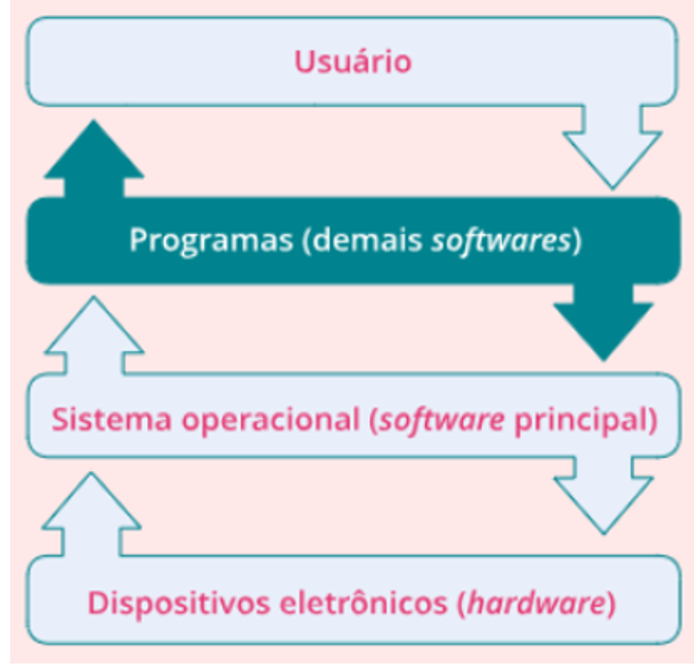
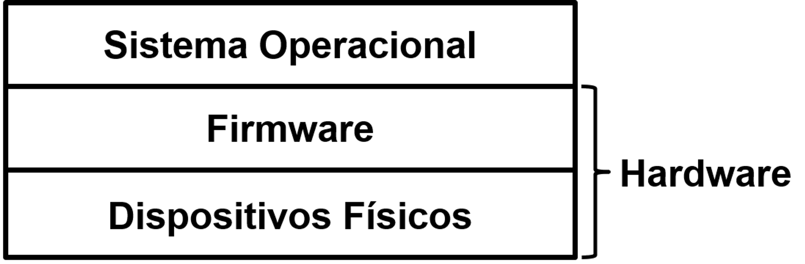
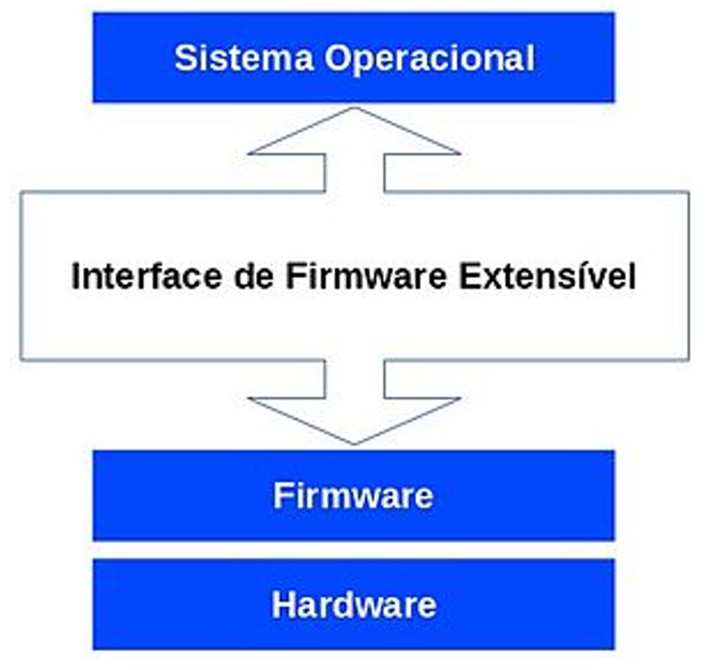
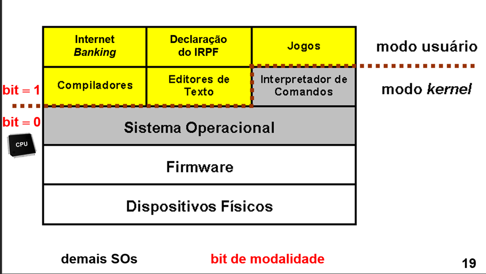
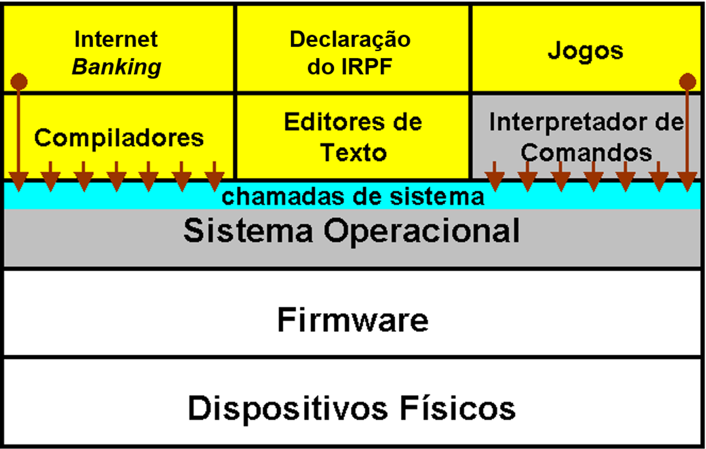
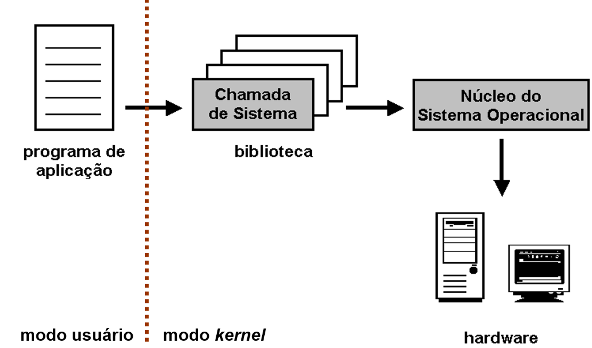
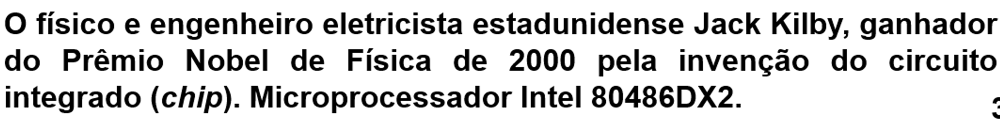
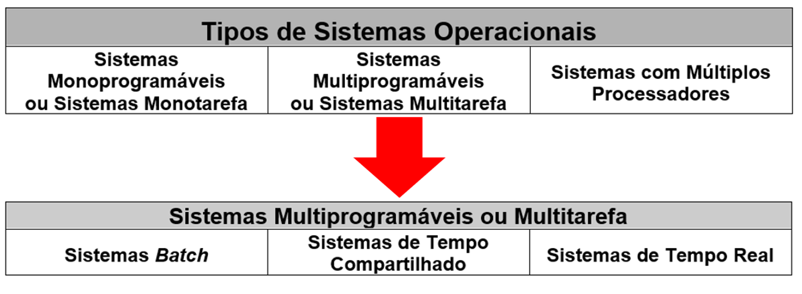

# Conceitos Básicos SO

# Objetivo

- Entender e aplicar os conceitos básicos da estrutura e de funcionamentos dos principais subsistemas
- Visando a eficiência e qualidade das aplicações dos recursos de hardware gerenciados pelo SO.

# Competências

- Conhecer os principais subsistemas de um SO.
- Descrever os principais subsistemas de um SO
- Entender os conceitos envolvidos sobre o gerenciamento de uma CPU e afins.
- Projetar programas com maior qualidade e eficiência.

# O que é um SO?

É uma camada dde software colocada sobre o hardware para gerenciar todos os componentes do sistema apresentando-o ao usuário como uma interface simples de entender e programar

Firmware é um tipo de software que está diretamente integrado a um hardware específico, como uma placa-mãe ou um disco rígido, e controla como esse hardware interage com o restante do sistema. É um software que permite ao hardware funcionar corretamente e realizar suas funções. Diferente do software convencional, o firmware não pode ser alterado ou deletado pelo usuário final sem instruções específicas.

Firmware = BIOS do SO

---

# BIOS

É um sistema básido de entrada e saída (Basic Input/Output System)

## POST

O POST (Power-On Self Test) é um processo executado pela BIOS ao iniciar o computador. Ele verifica o hardware básico para garantir que tudo esteja funcionando corretamente antes de carregar o sistema operacional.

## Boot Loader

O Boot Loader é um componente da BIOS que localiza e inicia o sistema operacional quando o computador é ligado. Ele carrega o sistema operacional de um disco rígido ou SSD para a memória do computador e, em seguida, transfere o controle para o sistema operacional continuar o processo de inicialização.

## Interrupções de BIOS

As interrupções da BIOS são procedimentos armazenados no firmware da BIOS que gerenciam a comunicação entre o sistema operacional e os dispositivos de hardware. Quando um dispositivo precisa da atenção do processador, ele envia um sinal de interrupção. A BIOS então interrompe temporariamente o sistema operacional, permitindo que o hardware e o sistema operacional se comuniquem efetivamente.

---

# UEFI

A Interface Unificada de Firmware Extensível

- Define uma interface entre o SO e firmware da plataforma
- Permite o controle remoto da máquina e reparação de máquinas mesmo sem SO

---

# Sistemas Operacionais

Forma de ver um SO

### Máquina Virtual:

É uma visão de cima para baixo na qual o SO é visto como uma extensão do hardware que implementa uma interface para as aplicações

Ela permite que um sistema operacional seja executado dentro de outro, fornecendo isolamento e abstração de hardware, permitindo que diferentes sistemas operacionais sejam executados simultaneamente no mesmo hardware físico. Isso é útil para testes de software, desenvolvimento, execução de sistemas legados e várias outras aplicações.

### Gerente de Recursos:

É uma visão de baixo para cima na qual o SO é visto como um controlador dos recursos do sistema 

Gerente de Recursos é uma maneira de visualizar o Sistema Operacional (SO) de uma perspectiva de baixo para cima. Neste contexto, o SO é visto como um controlador dos recursos do sistema. Isso significa que o SO é responsável por gerenciar e alocar recursos de hardware, como memória, tempo de CPU, espaço em disco e periféricos, para os vários programas e aplicações que estão sendo executados. O objetivo é garantir que todos os programas e aplicações tenham os recursos de que precisam para funcionar eficientemente, mantendo o sistema global a funcionar de forma suave e eficaz.

## FUNÇÕES de um SO

As principais funções são

- Esconder complexidade do hardware do progrmador
- Proteger o hardware da ação direta do usuário
- Fornecer um conjunto de instruções convenientes para o desenvolvimento de seu trabalho

---

# Modos de Acesso

Para proteção do hardware o SO impõe que há instruções que só podem ser realizadas por ele mesmo ou sob sua supervisão, com isso temos:

- Instruções privilegiadas: São capazes de comprometer a segurança e integridade do sistema computacional (Instruções de E/S e de ativação/desativação de interrupções)
- Instruções não-privilegiadas: Não oferecem risco

E com isso são criadas do modos de acesso MODO DE USUARIO e MODO NUCLEO/KERNEL

Nesse caso o SO é executado no modo NUCLEO e o restante no modo usuário

---

# Chamadas de Sistema

As chamadas de sistema são um conjunto de instruções estendidas que o sistema operacional disponibiliza para que os programas possam interagir com recursos do sistema, como acesso a arquivos, comunicação com dispositivos de hardware, gerenciamento de memória, entre outros.

Fornecendo uma interface padronizada e segura para que os programas solicitem serviços ou recursos do sistema operacional, permitindo assim a execução das tarefas necessárias para o funcionamento dos aplicativos. 

As quais podem ser divididas em 5 catergorias principais:

- Controle de Processos
- Gerenciamento de arquivos
- Gerenciamento de dispositivos
- Manutenção de info.
- Manutenção de comunicação

Quando trabalhamos com sistemas UNIX chamamos de chamadas de sistemas

E quando utilizamos Windows o mesmo conceito assume o nome de Interface de Programação de Aplicação (API)

Para cada serviço há uma chamada de sistema associada e cada SO tem seu próprio conjunto de chamadas de sistema. Desta forma não há portabilidade direta de chamada de sistemas entre SO’s

### POSIX

Portable Operating System Interface for UNIX

Proposto pela ISO e IEEE, é u mpadrão que especifica o conjunto de chamada de sistemas para que haja portabilidade para qualquer SO que suporte o padrão POSIX. Por sua vez, essa documentação é paga, fazendo com que haja uma migração para adoção do SUS (Single UNIX Specification) de responsabilidade OPen Group que é aberta e aceita contribuições de todos e é disponível na Internet.

---

# Evolução dos SOs

**1a Geração (1945 ~ 1955):**

 **- Computadores baseados em válvulas.**

 **- Programação em código de máquina.**

 **- Advento do cartão perfurado.**

 **- Ausência de linguagem de programação.**

 **- Ausência de sistema operacional.**

ENIAC → 1º computador digital eletrônico de grande escala

**2a Geração (1955 ~ 1965):**

 **- Computadores baseados em transistores.**

 **- Primeiras linguagens de programação.**

 **- Sistema *batch* (sistema em lote).**

 **- Sistema operacional primitivo**

1956 = 1º transistor (**John Bardeen, William Shockley e Walter Brattain - Prêmio Nobel)**

**3a Geração (1965 ~ 1980):**

 **- Computadores baseados em CIs  (SSI).**

 **- Sistemas operacionais genéricos.**

 **- Multiprogramação.**

 **- SPOOL.**

 ***- Time-sharing.***

 **- Crescimento dos minicomputadores.**

 **- MULTICS.**

 **- Desenvolvimento do UNIX.**

**4a Geração (1980 ~ dias atuais):**

 **- Computadores baseados em CIs (LSI, ...).**

 **- Computadores pessoais.**

 **- Redução do preço dos computadores.**

 **- Desenvolvimento de interfaces amigáveis.**

 **- Sistemas operacionais para redes.**

 **- Sistemas operacionais distribuídos.**

---

# Núcleo do SO (kernel)

Conjunto de rotinas que oferece serviços ao usuário, programas de aplicação e ao próprio sistema computacional

Principais funções:

- Tratamento de interrupções e excessões
- Criação e eliminação de processos e threads
- Sincronização e comunicação entre processos e threads
- Escalonamento e controle dos processos e threads
- gerencia de  memória
- gerencia do sistema de arquivos
- gerncia de dispositivos de entrada e saída (E/S)
- Suporte da redes locais e distribuídas
- Controle da utilização dos recursos dos sistema computacional e funções de auditoria
- Segurança do sistema computacional

---

# SO x Aplicações convencionais

A grande difrença entre esses dois é a maneira como as rotinas são excutadas

Um SO não é excutado de maneira linear (início, meio e fim). Suas rotinas são excutadas concorrentemente em função de eventos assíncronos (que não se realiza ao mesmo tempo de outro), ou seja, eventos que podem ocorrer a qualquer momento.

Muitos desses eventos estão relacionados ao hardware e às tarefas internas do próprio SO

---

# Tipos de SO

- Desenvolvidos em 1960
- Chamdasos de sist. batch / lote
- 1ºs sitemas multiprogramáveis

### JOBS

Os programas, também chamados ***jobs***, eram submetidos para execução através de cartões perfurados e armazenados em disco ou fita, onde aguardavam para serem processados. Posteriormente, em função da disponibilidade de espaço na memória principal, os programas eram executados, produzindo uma saída em disco ou fita.

Para aumentar a velocidade de processamento, os operadores reuniam os *jobs* em **lotes** com requisitos semelhantes e os operavam no computador como um grupo.

O processamento *batch* caracteriza-se por não exigir a interação do usuário com o programa de aplicação, isto é, todas as entradas e saídas de dados do programa de aplicação são realizadas por algum tipo de memória secundária (disco ou fita).

### TIME-SHARING

Sistemas de tempo compartilhado permitem que vários programas sejam executados a partir da divisão do tempo do processador em pequenos intervalos de tempo denomindados fatia de tempo (time-slice)

Nisso cada progrma tem direito de ser executado por uma fatia de tempo. Caso a fatia não seja suficiente, o programa em execção é interrompido pelo SO e substituído por outro, permancendo em aguardo para uma nova fatia de tempo

### REAL TIME SYSTEMS

São desenvolvidos de forma semlhante ao time-sharing

Mas a grande diferença é que os sistemas de tempo real são altamente acoplados ao mundo externo, isto é, devem responder no domínio do mundo físico, em uma escala ditada por este e sob rigorosas restrições de desempenho. Utiliza o tempo que for necessário para execução

Assim, são utilizados RTOS (Real Time Opertating Systems)
