# Conceitos Básicos de Processo

## Processos

É um programa e mexecucção, sendo que o processador é chaveado entre o vários processos. 

O rápido chaveamento entre os diversos programas em execucção chama-se multiprogramação

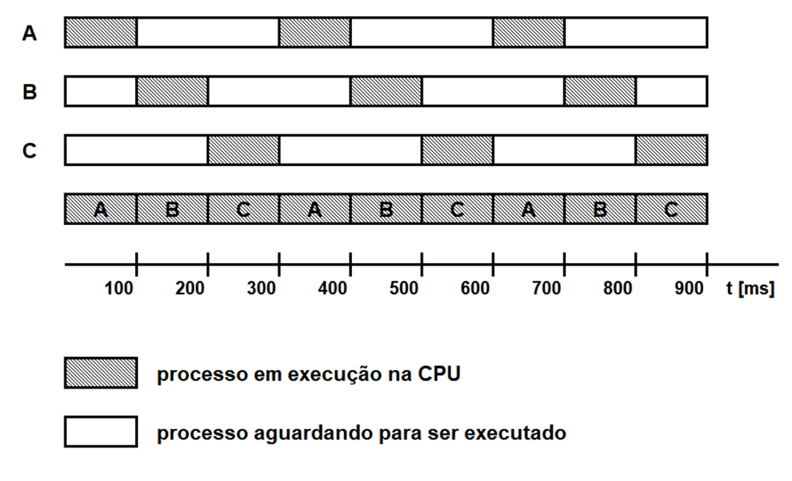

O processador sendo chaveado entre os diversos processos dá a eles dezenas de milésimos de segundo (ms) de processamento. Nisso embora em algum instante apenas um programa esteja e execução, o processador pode ter trablhado para diversos processosm dando ao usuário impressão de paraleliso de execução 

---

# Estados de um Processo

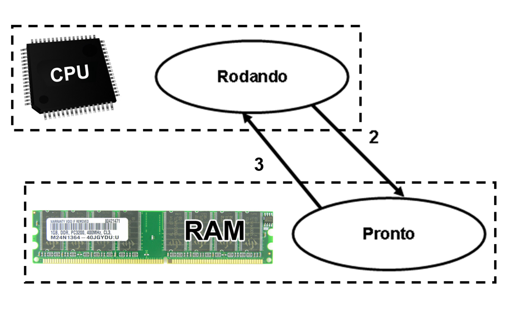

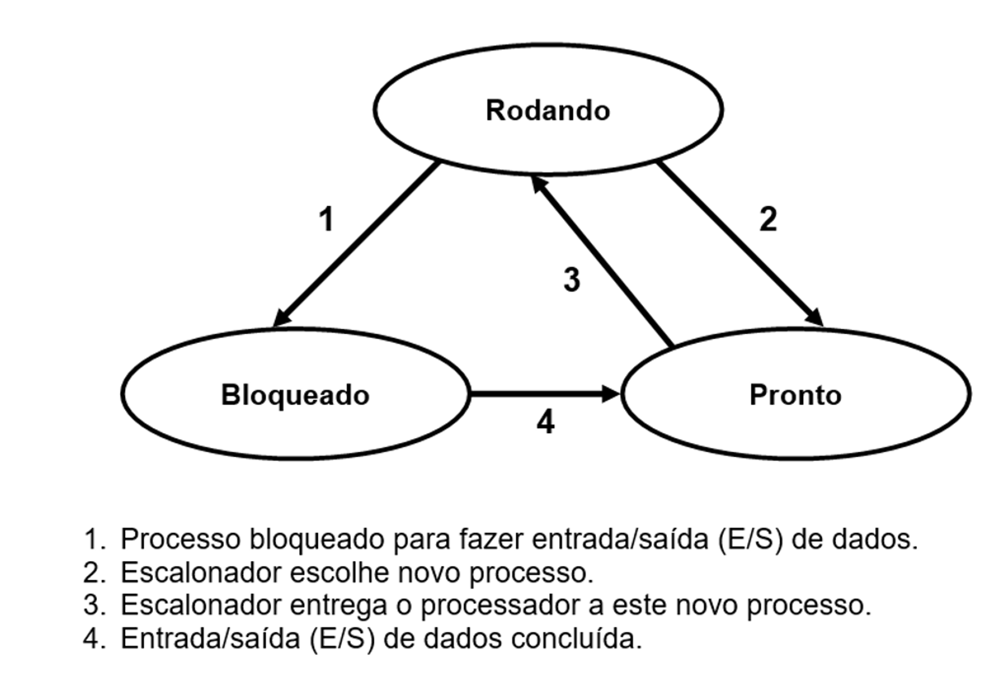

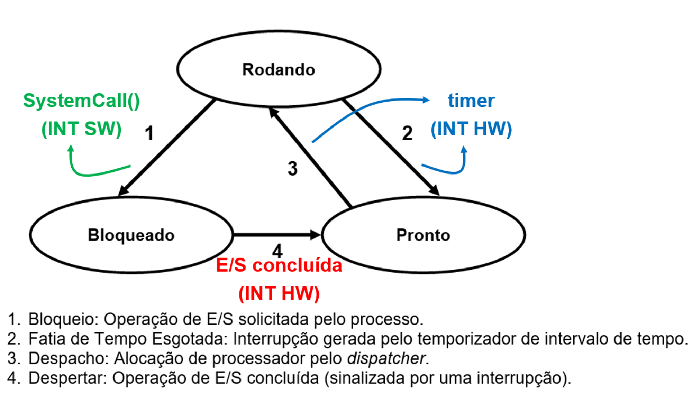

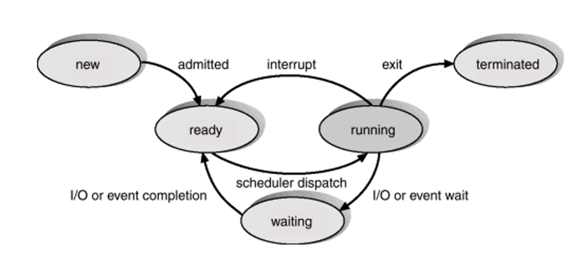

Com isso, em um sist multi, um processo não é executado durante todo o tempo pelo processador. Durante sua existência, um processo passa pelos seguinte estados

- Execução/Rodando (Running) → Usando o processador naquele instante
- Pronto (Ready) → Em condições de ser executado
- Espera/Bloqueado (Wait) → Impedido de ser executado até que occorra um determinado evento externo ao processo

---

# Contexto de Hardware

Armazena o conteúdo dos registradores gerais do processador e do registradores de uso específico

Quando um processo está em execução, seu contexto de hardware está armazenado nos registradores do processador. No momento em que o processo perde a utilização da CPU, o SO salva as info no contexto de hardware do processo.

Ele especifica características do processo e limites do recursos que podem ser alocados pelo processo e é composto por 3 grupos de info:

- Identificação → aqui o processo recebe um PID (Process Identification), identificação única, através dele o SO e outros processos podem referenciar qualquer processo. Também pode existir identificadores por nome
- Quotas → Representam os limites de cada recurso do sistema computacional que o processo pode alocar. Ex: máx de arqvs. abertos ao mesmo tempo e etc.
- Privilégios → Define as ações que um processo pode fazer em relação a si mesmo, aos demais processos e ao SO. Aos prvilégios que afetam o processo temos: prioridade de execução, tamanho máximo de memória principal que pode ser alocada e etc. Em relação ao SO: alteração de regras de segurança, alteração de parâmmetros de config do sist e etc.

---

# Espaço de Endereçamento

Representa área de memória pertencente ao processo onde as instruções e os dados do progrma são armazenados para execução. Cada processo possui seu espaço.

---

# Troca de Contexto

É a troca de um processo por outro na CPU.

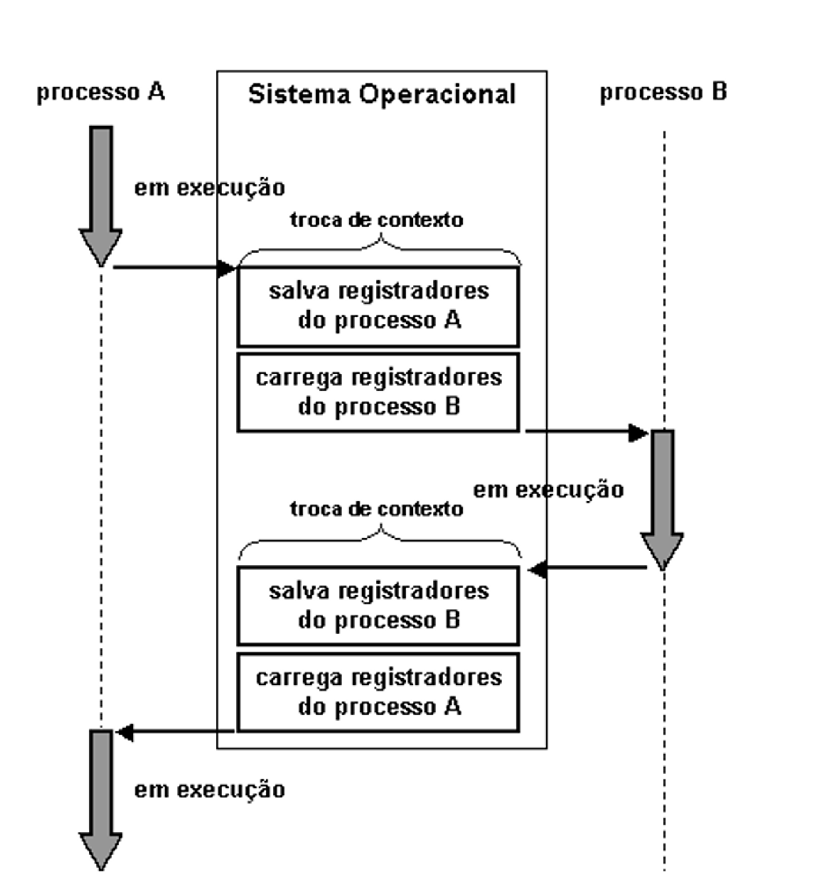

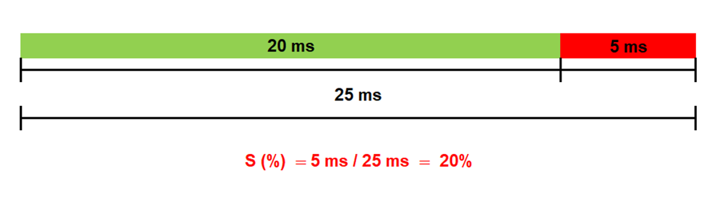

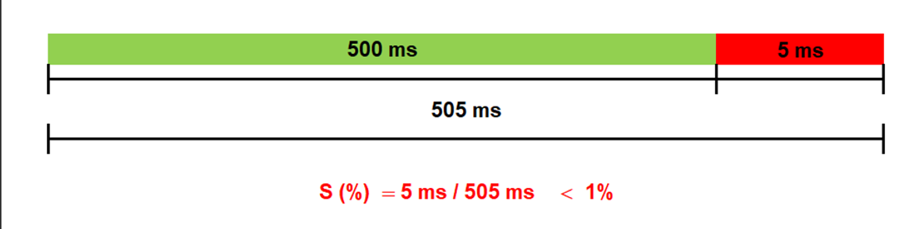

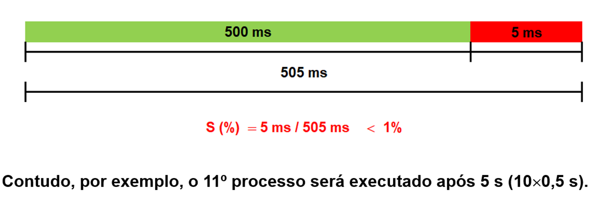

---

# Bloco de Controle de Processo

Cada processo é implementado pelo SO através de uma estrutura de dados chamada Bloco de Controle de Processo (PCB), a partir da qual o SO mantém todas as info sobre o contexto de hardware, o intexto de software e o espaço de endereçamento.

O conjunto constituído pelo programa a ser executado, pelo PCB, pelos dados e pela pilha representa a manifestação físixca de um processo → Imagem do Processo

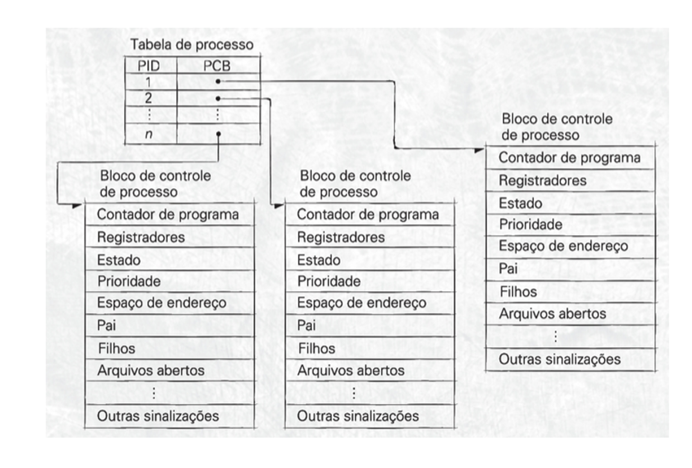

---

# Tabela de Processos

Para construir o modelo de processo, o SO deve manter uam tabela de processo com uma entrada por processo

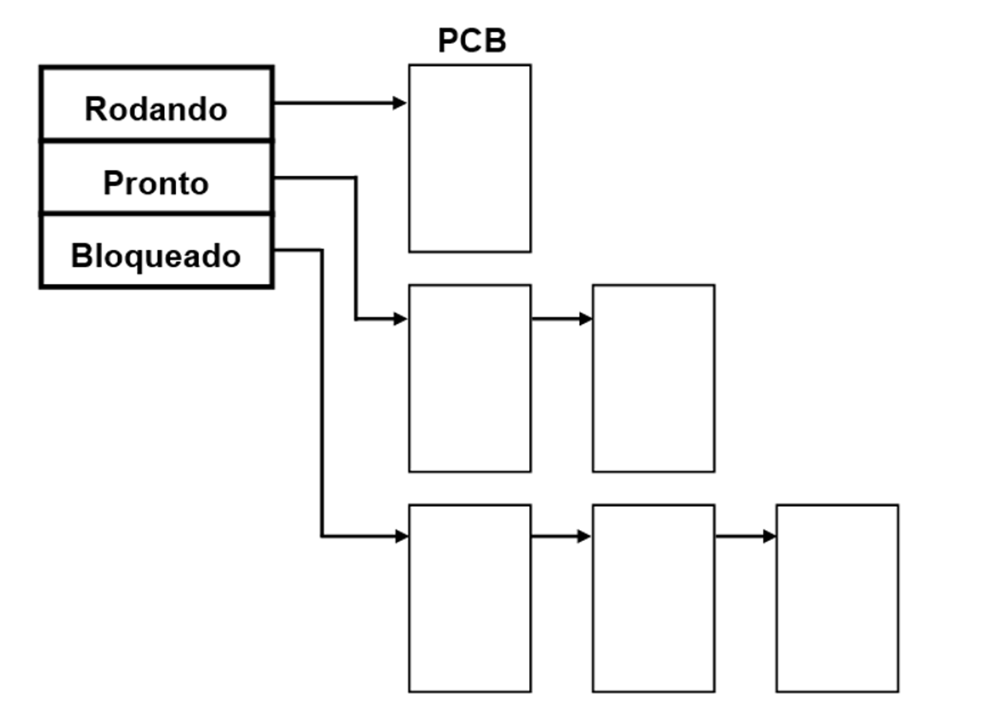

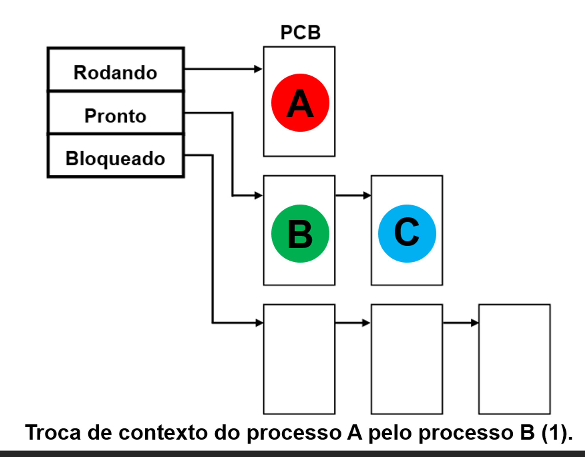

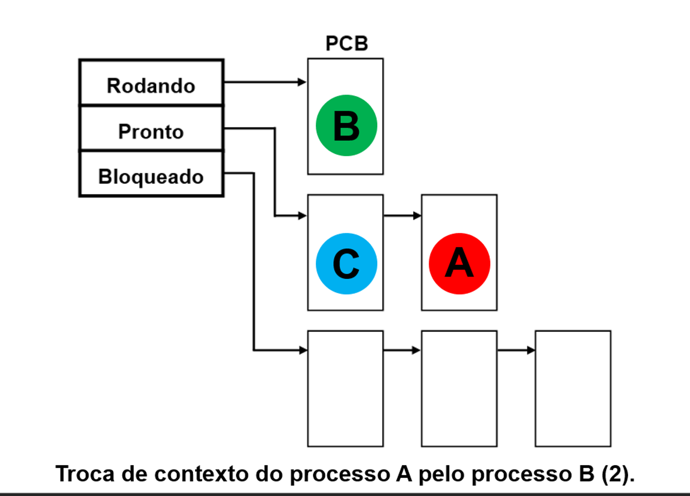