# AULA 01/04 - ACL ESTENDIDA

[Aula 07 2024 ACL.pkt](https://prod-files-secure.s3.us-west-2.amazonaws.com/7fcb26bc-7e98-4600-9532-f1d6c7affda3/3cf31d60-ed77-4afa-b1b8-9ac0289b7d59/Aula_07_2024_ACL.pkt)

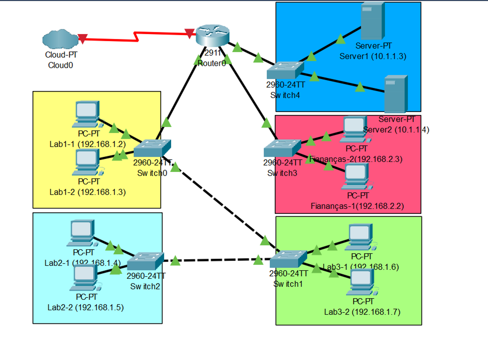

## É possível ver as regras de ACL configuradas no roteador?

Para essa pergunta a resposta é sim. Basta dar um “enable” e em seguida “show run”, onde mostrará todas as configurações das intefaces. Outra forma é escrever “show access-lists”

- Utilizando o show acess-list vemos quantas vezes cada regra foi usada
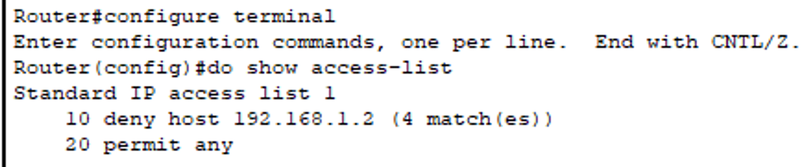


---

## Removendo um Grupo de regras da ACL

No modo de configuração de roteador bastar aplicar um “no” na frente das regras de ACL para remover o conjunto de regras

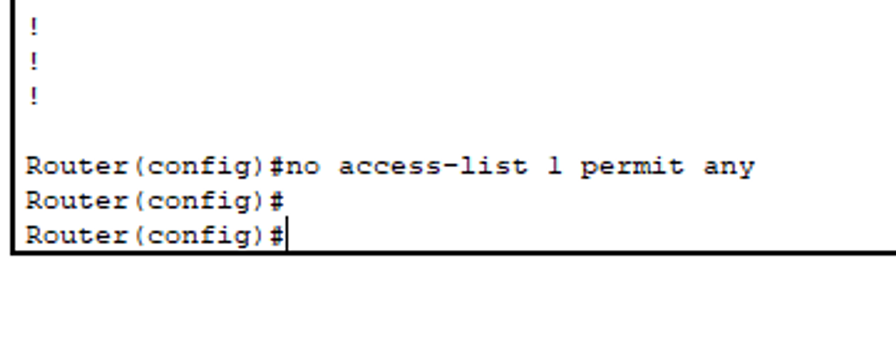

---

## Até o momento fora criadas regras que olhavam apenas para o endereço de origem dos pacotes mas agora iremos configurar olhando tanto para a origem quanto para o destino!!

E quando queremos um destino em específico temos que trablhar com ACL estendida

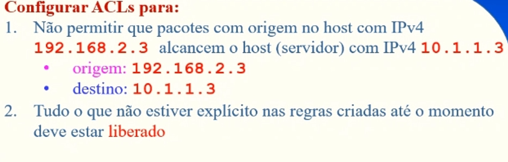

Como exemplo prático faremos com que:
Esse equipamento 

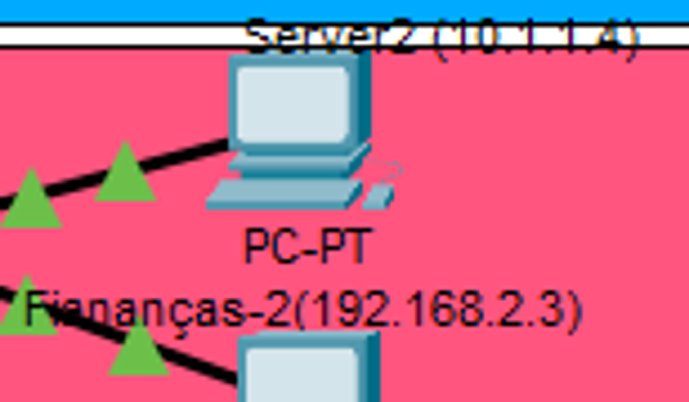

Não atinja o servidor

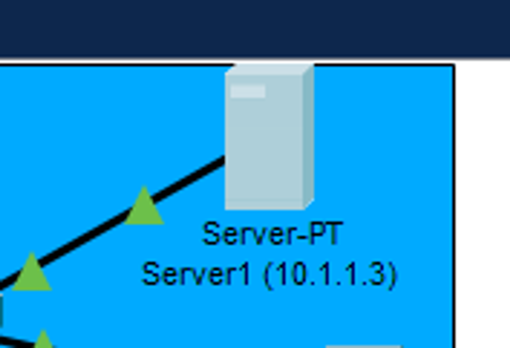

E tudo que for fora disso está liberado o acesso

Nesse caso não coseguiriamos configurar com ACL padrão pois ela impede o pacote por completo de atravessar a interface

## Como trablhar com as ACL?

Elas usam um intervalo de nº difrente das padrões 

Usam de 100-199
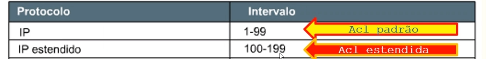

E tbm possuem mais parâmetros 

```nasm
ROUTER(CONFIG)# access-list <nº da lista de acesso> {permit/deny} <protocolo> <origem>
								[máscara da origem] <destino> [máscara do destino] <operador> [operando]
```

Claro que não é obrigatório passar todos os parâmetros 

Como exemplo podemos ter

```nasm
router# access-list 103 permit tcp host 10.0.0.3 host 192.168.10.4 eq 80
```

---

## Aplicando no roteador

Definindo a ACL estendida

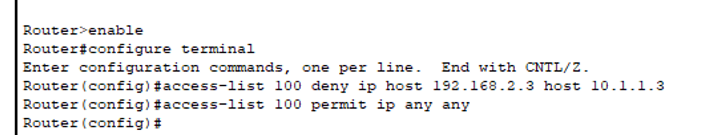

Aplicando na interface

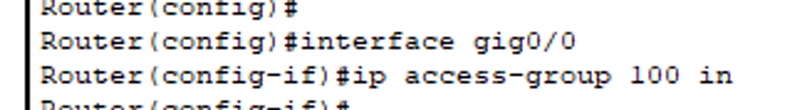

Realizando um teste de ping 

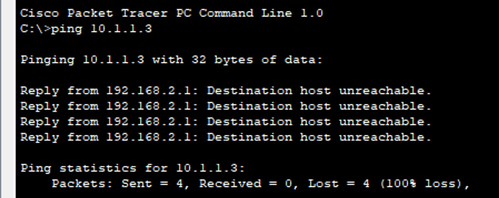

---

## SOBRE O CHECK - PREPARAÇÃO
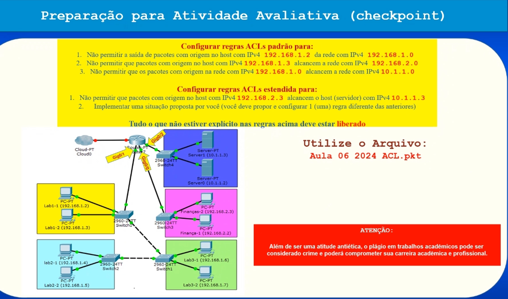