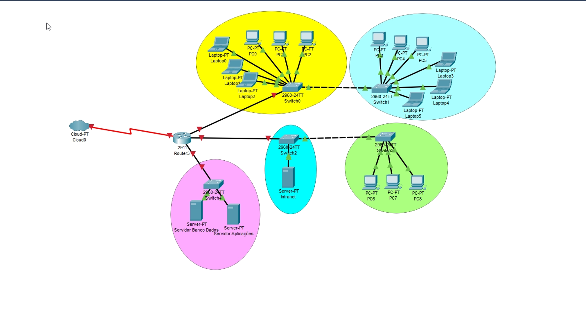

# AULA 26/02 - Revisão de conteúdo do ano passado

Ainda continuamos com revisão de matéria

[Aula_02_2024_3SI_Revisão_parte_I.pdf](https://prod-files-secure.s3.us-west-2.amazonaws.com/7fcb26bc-7e98-4600-9532-f1d6c7affda3/d88677c0-ef32-4a7c-bf81-800a2f5e1765/Aula_02_2024_3SI_Reviso_parte_I.pdf)

Página 44 em diante

### Recordando coisas sobre SWITCHES

- Switches comumentes servem para ampliar o tamanho de uma rede
- Seus preços variam e nessa variação de preço ocorre o aumento de recursos disponíveis por eles
- São dispositivos de menos tecnologia comparado aos roteadores
- Servem a partir da segunda camada com o endereçamento MAC
- Por conta disso não são capazes de realizar um papel de FIREWALL, não possuem uma proteção contra ataques. Ataques esse que normalmente ocorrem de dentro da própria rede

## Configurando uma rede Wireless

Considerando  o que foi comentado acima sobre os switches o ideal seria conectar essa rede direto ao roteador por conta do FIREWALL disponível, mas dada a situação não tem como pois o roteador não têm portas disponíveis para redes.

Com isso vamos atribuir a rede ao Switch 0 pois eles está fora da região de servidores, preservando a segurança da rede pois caso seja preciso acessar o servidor a partir da rede wireless será necessário passar pelo roteador (que possui o FIREWALL)



### Segurança X desempenho

Outro ponto a se destacar aqui é que como estamos conectando a rede Wireless ao Switch 0 temos que levar em consideração o broadcast que será gerado naquela região da rede pois considerando que qualquer dispositivo faça uma requisição essa requisição terá que passar por todos os outros dispositivos até chegar o roteador e o mesmo acontece quando o roteador tiver que devolver essa requisição 

Algo que seria menos impactante considerando que conectassemos a rede Wireless ao switch 4 por exemplo

Mas com isso é gerada a discussão que para se obter desempenho temos que abdicar de muitas políticas de segurança e para obter segurança perdemos muito com desempenho da rede

## VLAN

Porém tem algo que podemos fazer nessa situação impedindo que haja tanta perda de desempenho e que mantenha a segurança que é “dividindo” o switch em duas partes, criaremos uma área virtual para a rede azul e amarela, e uma outra área virtual para a rede Wireless

Impedindo que a área 1 consiga enviar dados (broadcast) para a área 2 e vice versa

### Criando uma área virtual
```
- Acesse o CLI do switch
- Aplique o “enable”
- “show vlan” - mostrará como as interfaces estão distribuídas (todas por padrão estão na “vlan 1”
- Nesse caso tiraremos a interface gig0/1 e aplicaremos a rede Wireless
- “configure terminal”
- “vlan 2” - criamos a vlan
- “name <nome da vlan>” - nomeamos a vlan
- Quando estamos no modo de “configure terminal” para vermos o “show vlan” temos que escrever “do show vlan”
- “interface gig0/1” - acessamos a interface escolhida para vlan
- “switchport access vlan 2” passamos o acesso da innterface/porta para a vlan 2
```
### Não está concectada com o roteador

E assim foram criadas as área isoladas onde o broadcast de uma não interfere na outra

Mas temos um outro problema a rede Wireless ainda não consegue acessa o roteador pois quando os dados da rede Wireless chegam ao Switch só existe a interface gig0/1 configurada a VLAN 2

Com isso precisamos que a interface que atende ao roteador e as outras áreas da rede também atenda a VLAN 2, criar uma interface tronco

## Criando uma interface tronco(trunk)

Na situação temos a interface “FastEthernet0/1” que está na VLAN 1 que a princípio está atendendo a a VLAN precisamos fazer com que está porta ser compartilhada entre as duas VLAN’s, consiga trafegar dados nas duas rede virtuais

Na área CLI do SWITCH em “Switch (config-if)#”:

- “interface fa0/1” = para acessar a interface desejada
- “switchport mode trunk” = aplicando a interface tronco para a interface
- “SWITCHPORT TRUNK ALLOWED VLAN ALL” = permitindo que ela acesse todas as VLANs

### Problema agora com o roteador

Por mais que tenhamos feitos as devidas configurções com o switch ficou faltando configurar o roteador pois o mesmo ainda não teve sua interface configurada, interface essa que é gateway

Teremos que criar um endereço de rede para a VLAN 2 e para VLAN 1

## Configurando a rede da VLAN 2

No caso definimos 
```
Endereço de rede 192.168.10.0

Gateway 192.168.10.1

Mascára 255.255.255.0
```
## Configurando a rede da VLAN 1
```
Endereço de rede 192.168.14.0

Gateway 192.168.14.1

Mascára 255.255.255.0
```
## Configurando o roteador

Note que se formos em INTERFACE e irmos na gig0/0 só poderemos configurar um IP naquela porta mas precisamos atender DUAS redes

Logo acessamos o CLI do roteador e ali precisaremos dividir a interface gig0/0 ao meio, em duas

No CLI
```
- “enable”
- “configure terminal”
- “interface GigabitEthernet0/0” - acessemos a interface
- “interface gig0/0.1” - Dividimos a interface
- “encapsulation dot1q 1” - define que a interface está associada à VLAN 1
- “ip address 192.168.14.1 255.255.255.0” - rede que será atendida, ip + máscara
```
Agora é so repetir os mesmos passos para a VLAN 2 (ainda em “Router (confif-subif)")
```
- “interface gig0/0.2”
- “encapsulation dot1q 2”
- “ip address 192.168.10.1 255.255.255.0”
```