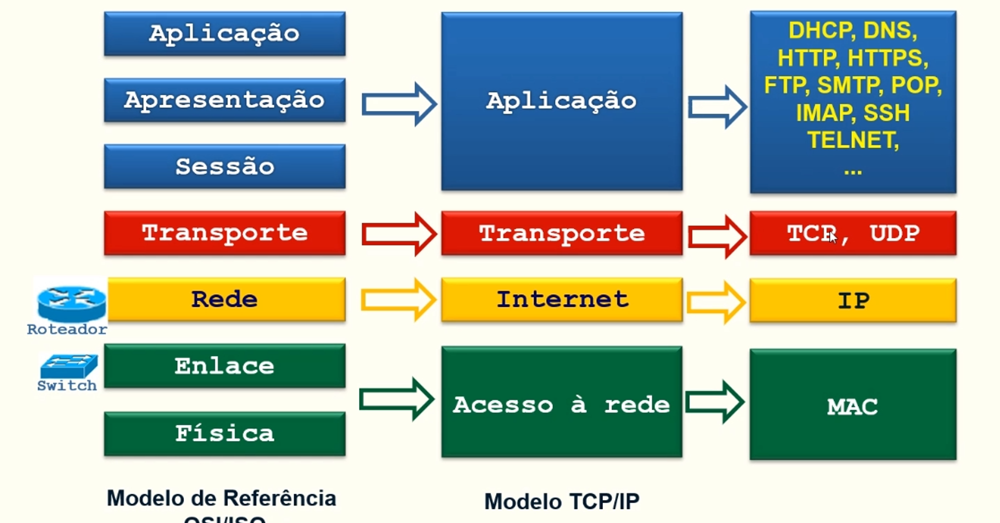

# AULA 08/04 - PREPARAÇÃO CHECK02

[Aula 08 2023 ACL.pkt](https://prod-files-secure.s3.us-west-2.amazonaws.com/7fcb26bc-7e98-4600-9532-f1d6c7affda3/1c2c26f3-8ea5-47e4-9c6c-ff0e5e2e142b/Aula_08_2023_ACL.pkt)

[Aula 08 2024 Segurança com ACL e Firewall Parte III.pdf](https://prod-files-secure.s3.us-west-2.amazonaws.com/7fcb26bc-7e98-4600-9532-f1d6c7affda3/26e3ef60-812f-44d0-a8f1-6f1b144ceab6/Aula_08_2024_Segurana_com_ACL_e_Firewall_Parte_III.pdf)


Nessa aula preparatória iremos trabalhar com TCP e do UDP, com endereço IP de destino e de origem

Mas antes uma breve revisão de ACL

---

### ACL ESTENDIDA - Breve Revisão

- As ACLs estendidas são usadas mais frequentementes para testar condições por proporcionarem um INTERVALO MAIOR DE CONTROLE que as ACLs padrões
- As ACLs estendidas verificam os ENDEREÇOS DE ORIGEM E DE DESTINO dos pacotes
- ACLs estendidas também podem verificar PROTOCOLOS ESPECIFICOS (IP, TCP, UDP e etc.), nº de portas e outros parâmetros
- Isso torna MAIS FLEXIVEL o processo de descrever que tipo de verificação a ACL fará
- O tráfego de pacotes pode ser permitido (PERMIT) ou recusado (DENY) baseada em onde o pacote foi originado e/ou no seu destino


---

## REVISANDO O QUE É TCP

É um modelo que divide as camadas de protocolos, no caso do TCP/IP ele divide em 4 camadas. Com essa informação poderiamos configurar o firewall a partir de camada

Mas para aula iremos focar na camada de TRANSPORTE 




---

### DUVIDAS DA AULA

É possível criar uma regra para bloquear 1 protocolo/serviço espercífico?

- Sim é possível criar esse tipo de regra

---

## Usando exemplos para melhor fixação


Situação: Considerando o tráfego com origem na rede 172.16.3.0/24 conectada à porta E0 do roteador com destino ao servidor 172.16.4.13, conecta à porta E1 do roteador, é possível criar regras ACL Extend para:

- Permitir o tráfego ao serviço correio eletrônico (porta TCP 25) de qualquer endereço de origem

```
router# access-list 101 permit tcp any host 172.16.4.3 eq 25
```

- Negar logins remotos via SSH (porta TCP 22)

```
router# access-list 101 deny tcp any host 172.16.4.13 eq 22
```

- Negar transferências de arquivos via FTP (porta TCP 20 e 21)

```
router# access-list 101 deny tcp any host 172.16.4.13 eq 20
router# access-list 101 deny tcp any host 172.16.4.13 eq 21
```

- Permitir qualquer outro tráfego

```
router# access-list 101 permit ip any any

// Nesse caso podemos usar o IP, pois pra qualquer outro tráfego 
pode ser qualquer outra porta basta a gente usar protocolo ip (ele ENGLOBA todas as
portas TCP e UDP)
```

- Aplicar as regras na entrada (in) da interface E0 do roteador

```
router# interface e0
router# ip access-group 101 in
```

---

### Mais exemplos


- Permitir o acesso do host A (172.16.3.2) a todos os serviços deisponíveis na rede 172.16.4.0 e bloquear o tráfego desse host para a Internet (bloqueio total a qualquer serviço na Internet). Todos os demais tráfegos deverão estar liberados.

```
router# access-list 102 permit ip host 172.16.3.2   172.16.4.0   0.0.0.255
router# access-list 102 deny ip host 172.16.3.2 any
router# access-list 102 permit ip any
router#
router# interface e0
router# ip access-group 102 in
```


- Bloquear o acesso do host A (172.16.3.2) ao serviço SSH (porta TCP 23) no servidor 172.16.4.13

```
router# access-list 103 deny tcp host 172.16.3.2  host 172.16.4.13  eq 23
```

- Bloquear o acesso do host E (172.16.3.5) ao serviço de HTTP (porta TCP 80) no servidor 172.16.4.13

```
router# access-list 103 deny tcp host 172.16.3.5 host 172.16.4.13 eq 80
```

- Liberar o acesso de qualquer equipamento da rede 172.16.3.0 a qualquer serviço da rede 172.16.4.0

```
router# access-list 103 permit ip host 172.16.3.0 host 172.16.4.0

// Correção com base no slide
router# access-list 103 permit ip 172.16.3.0   0.0.0.255    172.16.4.0   0.0.0.255
```

- Liberar qualquer outro tráfego com o origem na rede 172.16.3.0 para qualquer destino

```
router# access-list 103 permit ip host 172.16.3.0 any

//Correção com base no slide
router# access-list 103 permit ip 172.16.3.0   0.0.0.255    any
```

- Configurando na interface

```
router# interface e0
router# ip access-group 101 in 
```

---

### Sobre as máscara vistos nos exs

O professor disse que não vai explicar elas por agora e irá deixar pra depois do checkpoint2, mas seria algo a ver com máscara curingas

---

# PARTINDO PARA O CONTEUDO DA AULA

)

1. Bloquear acesso do IP 10.0.0.2 ao serviço http disponível no servidor 172.168.10.4
2. Bloquear acesso IP 10.0.0.3 ao serviço ssh disponível no servidor 172.16.1.4
3. Permitir o acesso do ip 10.0.0.3 apenas ao serviço http disponível no servidor 192.168.10.4
4. O acesso ao demais endereços/serviços disponíveis na rede 192.168.1.0 deverão estar proibidos para o ip 10.0.0.3


---

### 1- Bloquear acesso do IP 10.0.0.2 ao serviço http disponível no servidor 172.168.10.4

Quremos bloquear o acesso a pagina https, ou seja, que não apareça a seguinte tela


```
Router(config)#access-list 101 deny tcp host 10.0.0.2 host 192.168.10.4 eq 80
//Tbm pode ser 
//**Router(config)#access-list 101 deny tcp host 10.0.0.2 host 192.168.10.4 eq http**
```

Configurando a interface 

```
Router(config)#interface gig0/1	
Router(config-if)#ip access-group 100 in
```


Mas lembre-se que quando aplicamos firewall tudo que não estiver explicíto na ACL será bloqueado po padrão pelo roteador

Então se queremos que os outros dispositivos da rede se conectem ao servidor citado no início temos que criar uma regra para eles

```
Router(config-if)#access-list 100 permit tcp host 10.0.0.3 host 192.168.10.4 eq 80
//Ou 
//Router(config)#access-list 100 permit ip any any
```


---

---

### 2 - Bloquear acesso IP 10.0.0.3 ao serviço ssh disponível no servidor 172.16.1.4

```
Router(config)#access-list 101 deny tcp host 10.0.0.3 host 172.16.1.4 eq 22
Router(config)#access-list 101 permit ip any any
Router(config)#
------------
//conf interface
Router(config)#interface gig0/1
Router(config-if)#ip access-group 101 in
```

---

---

### 3 - Permitir o acesso do ip 10.0.0.3 apenas ao serviço http disponível no servidor 192.168.10.4

```
Router(config-if)#access-list 102 permit tcp host 10.0.0.3 host 192.168.10.4 eq 80
Router(config)#access-list 102 deny ip host 10.0.0.3 192.168.10.0 0.0.0.255
Router(config)#access-list 102 permit ip any any
Router(config)#
--------------
Router(config)#interface gig0/1
Router(config-if)#ip access-group 102 in
Router(config-if)#
```

**SOBRE A MASCARA CURINGA** 

O professor comenta que em vez de aplicar um host específico ele aplica o endereço de ip da rede (192.168.10.0) seguido da máscara (curinga), pois com ela o roteador entende que é todos os equipamentos dentro da rede