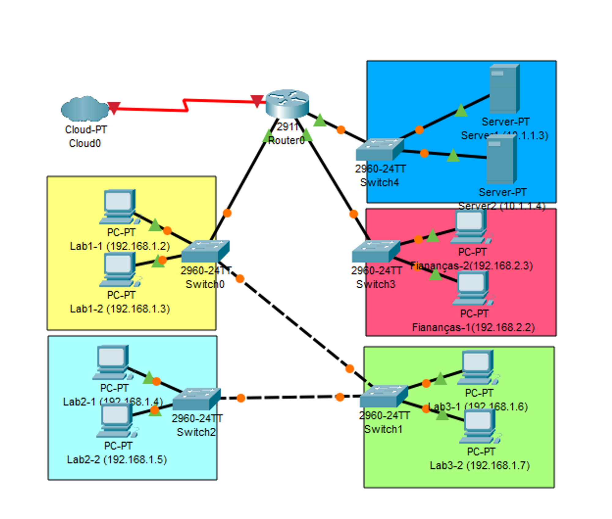
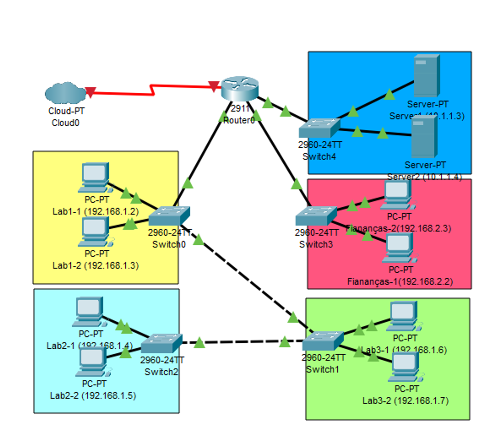
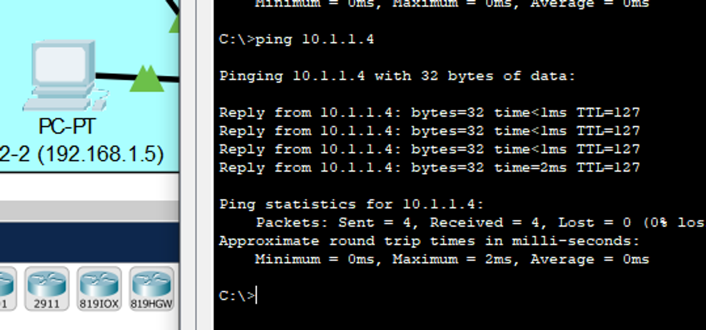
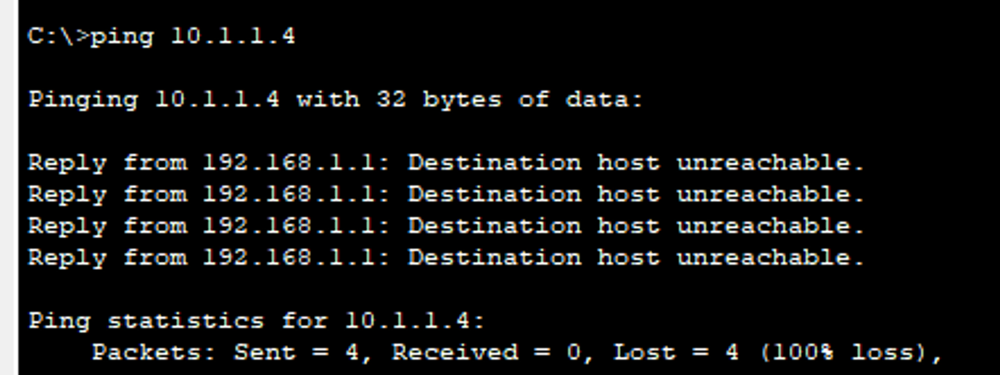
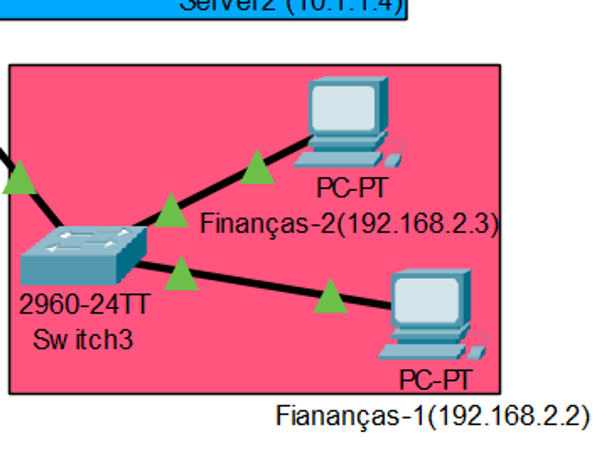
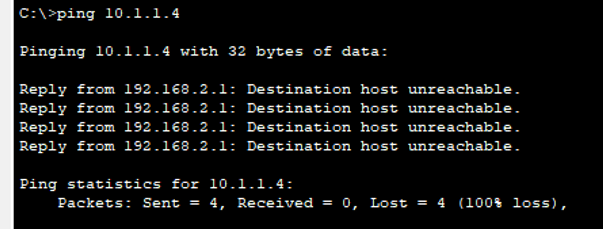
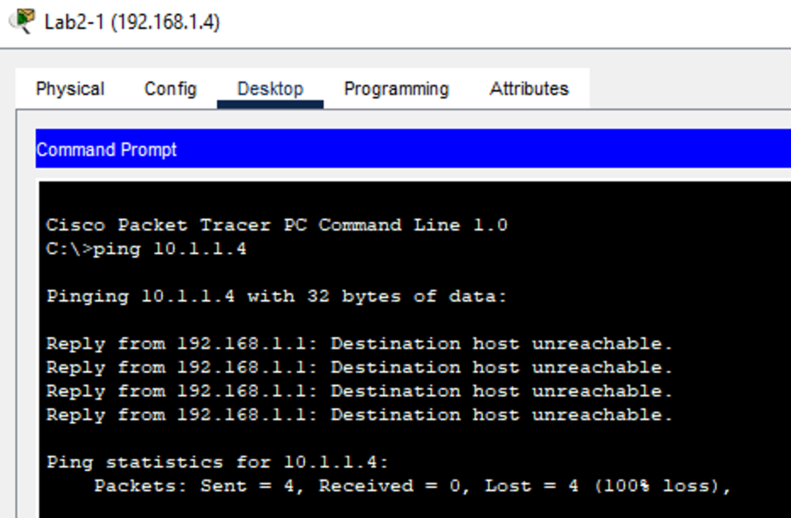
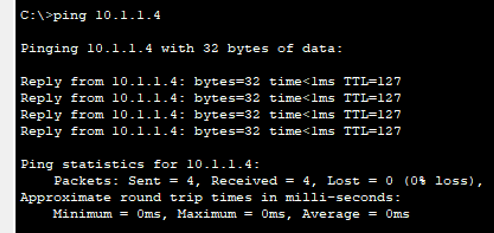
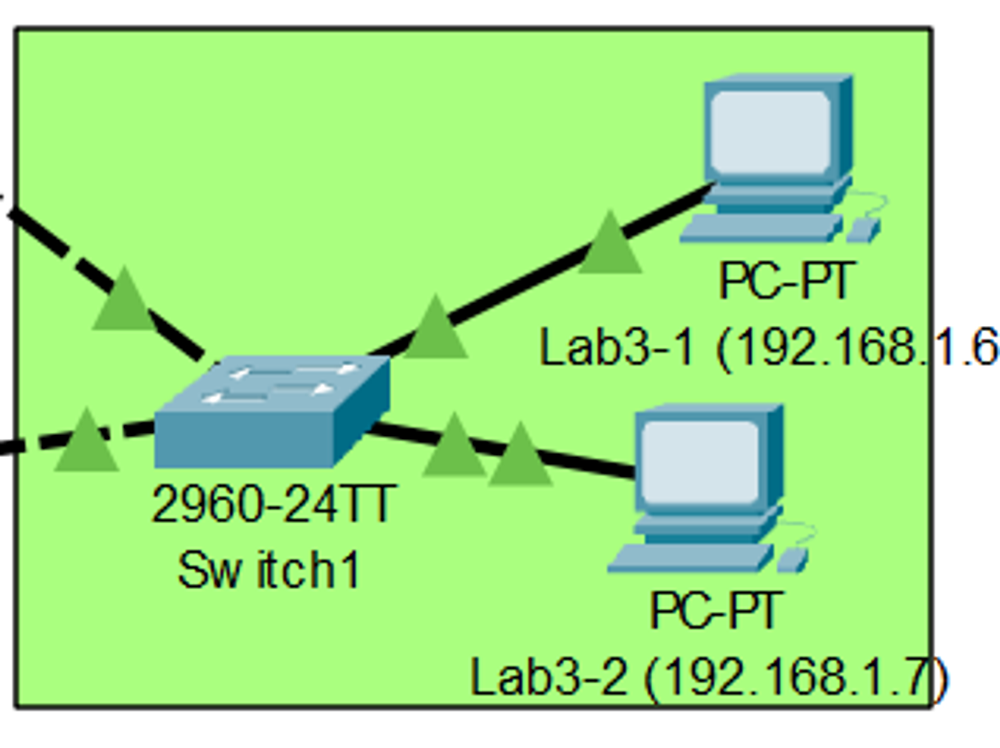
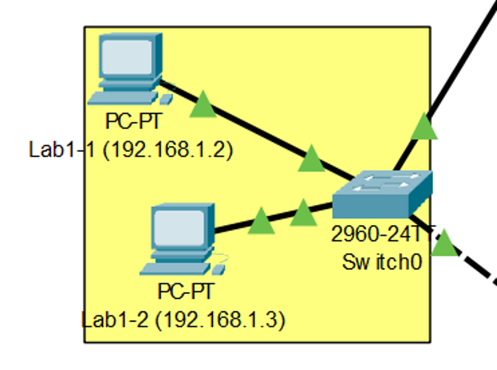

# AULA 25/03 - CONF DE RESTRIÇÃO DE ACESSO ÀS REDES

[Aula 06 2024 Segurança com ACL e Firewall.pdf](https://prod-files-secure.s3.us-west-2.amazonaws.com/7fcb26bc-7e98-4600-9532-f1d6c7affda3/29e95e2e-45de-442a-a5a9-23cc7bbc212e/Aula_06_2024_Segurana_com_ACL_e_Firewall.pdf)

[Aula 06 2024 ACL.pkt](https://prod-files-secure.s3.us-west-2.amazonaws.com/7fcb26bc-7e98-4600-9532-f1d6c7affda3/d5f6f334-8f7b-406e-b43b-16a1fd02072a/Aula_06_2024_ACL.pkt)



Com essa topologia trabalharemos a questão de permissão de acesso a diferentes redes

## FIREWALL

É um equipamento ou conjunto de equipamentos que garantem o controle da conexão entre duas ou mais redes

- Nesse caso a linha de cód em vermelho não passará para Home Network




Nessa topologia temos 3 redes com interfaces ligadas ao roteador e uma interface de rede ligado a internet

E com cada interface podemos aplicar 2 firewall, um que analisa os dados que entram no roteador e um dos que saem do roteador 

Nossa ideia é realizar as configurações de firewall direto do roteador

### Realizando testes sem Firewall

Aqui testamos um ping da maquina Lab2-2 para o Server2 e notamos que realizou os testes serem barrados 



Com isso em mente agora iremos configurar para que os pacotes que saiam dessa máquina não possam chegar ao Server2/Rede Azul

## Configurando o Firewall

No roteador na área de CLI e trabalharemos com o comando “access-list” seguido (na mesma linha) de um nº, que será responsável por agrupar o conjunto das instruções/regras que queremos passar, e as instruções/regras (permit/deny)

```
enable
configure terminal
access-list nº permit/deny ip do equipamento
```

No caso que precisamos fazer temos

```
enable
configure terminal 
access-list 1 deny host 192.168.1.5
```

Mas essa regra ainda não está ativa no roteador, o pacote ainda passrá caso realizemos um teste. Nisso falta nos dizer em qual interface ele será barrado. Logo temos:

```
enable
configure terminal 
access-list 1 deny host 192.168.1.5
------------------------------------------
interface gig0/2
ip access-group 1 out
------------------------------------------
```

Com isso realizamos a barragem do pacote quando ele ESTÁ SAINDO DO ROTEADOR



---

### A Importância de saber em qual interface aplicar o firewall

É importante saber em qual interface aplicar o firewall pois, usando o caso acima como exemplo, se aplicassemos o firewall na interface onde está localizado o computador desktop ele seria incapaz não só de acessar a rede do Server2 como TAMBÉM a Internet e outras redes como um todo 

---

## Realizando mais configurações de firewall

Agora iremos configurar o equipamento Finanças-1 (192.168.2.2) seja incapaz de acessar qualquer uma das redes da topologia



```
enable
configure terminal
access-list 2 deny host 192.168.2.2
-------------------------------------
interface gig0/0
ip access-group 2 IN
-------------------------------------
```



---

Realizaremos mais uma configuração, agora com o Server2 permitindo que ele envie dados para outras redes internas mas não possa enviar diretamente para a Internet

```
enable
configure terminal
access-list 3 deny host 10.1.1.4
--------------------------------
interface se0/0/0
ip access-group 3 out
-------------------------------
```

---

### E se colocassemos OUT em vez de IN nesse caso

De maneira muito superficial podemos dizer que não aconteceria nada, pois baseando nessa regra o roteador iria olhar os dados que estão vindo da internet com o endereço IP que colocamos para negar acesso mas como na Internet não vai ter ninguém com esse endereço IP PRIVADO (o qual ainda passaria por um NAT) ele nunca seria considerado pelo roteador e entraria sem nenhum problema

Mas fica a info que mais pra frente veremos regras em que podemos passar mais parâmetros, o qual podemos acrescentar endereço de destino e etc.

---

## Acrescentando regra a um ACL existente

Uma vez que criamos um access-list podemos acrescentar um comando sobre ele 

No caso do ACL 1 defnimos que o IP 192.168.1.5 será negado para rede azul, mas e o 192.168.1.4?

Como para ele NÃO tem nada DEFINIDO, ele SERÁ NEGADO a área azul



Então para tratar um caso devemos dizer como todos os outros equipamentos se comportaram na rede

Adicionaremos a regra

```
access-list 1 permit 192.168.1.4
```

- E agora com a regra aplicada, os pacotes passram sem problema



Mas isso só foi válido para esse equipamento, enquanto para os outros estão bloqueados 





Mas não precisaremos ficar permitindo equipamento por equipamento, no roteador fazemos

```
access-list 1 permit any
```

E mesmo que tenhamos digitado ANY (permitindo qualquer equipamento) isso não afetará o equipamento 192.168.1.5, pois a 1º regra que definimos foi que este equipamento seria negado para acessar a rede azul