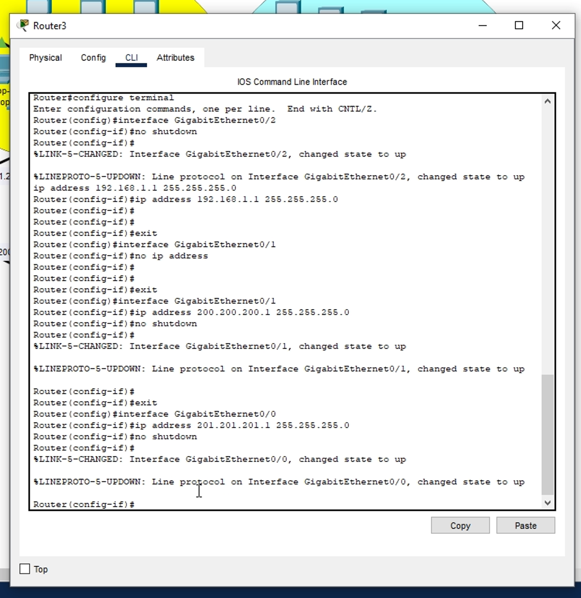

# AULA 19/02 - RECAPITULANDO

Hoje daremos início ao estudo de um recurso muito utilizado em redes: VLAN (Virtual Local Area Network).

De início precisaremos carregar o arquivo .pkt enviado por aqui e realizar a configuração de endereçamento IP.

[Aula_02_2024_3SI_Revisao 1.pkt](https://prod-files-secure.s3.us-west-2.amazonaws.com/7fcb26bc-7e98-4600-9532-f1d6c7affda3/df1c92f0-0022-4d21-9e43-882a85f1bd93/Aula_02_2024_3SI_Revisao_1.pkt)

Com o modelo acima deveriamos configurar 3 redes, definindo

- Gateway
- Aplicação DHCP por servidor
- Aplicação DHCP por roteador
- Aplicação manual (static) de IP

## Configurando a rede 1

Endereço de rede: 192.168.1.0

Gateway: 192.168.1.1

Máscara: 255.255.255.0

Após a definição dessas informações abrimos o roteador e realizamos a configuração abaixo:

- Ligamos a interface
- Colocamos o gateway (NÃO o endereço de rede)

Logo, acessamos o servidor e configuramos de maneira Static:

- Definimos o primeiro IP disponível depois do gateway e do endereço de rede

Realizamos as mesmas etapas no outro servidor

OBS: Sempre se atente com o IP que será colocado quando feito de maneira manual 

Realize um teste de ping

## Configurando a rede 2

Endereço de rede: 200.200.200.0

Gateway: 200.200.200.1

Máscara: 255.255.255.0

Após a definição dessa ainformações abrimos o roteador e realizamos a configuração abaixo:

- Ligamos a interface
- Colocamos o gateway (NÃO o endereço de rede)

### Configurando por DHCP

Vamos configurar a rede por DHCP mas primeiro devemos escolher um dispositivo pra isso (é recomendado usar um servidor)

Com o servidor 

- Definimos primeiro seu IP (lembrando o primeiro IP disponível após a definção do gateway e do endereço de rede de preferência)
    
    
    
- Acessamos a parte de “Services” do servidor
    - Ligamos o serviço
    - Colocamos o gateway definido na área destinada
    - E no “Start IP Address” precisamos colocar o ENDEREÇO DE REDE e NÃO do SERVIDOR
    
    
    

Após isso, conseguimos solicitar configuração por DHCP nos dispositivos finais

## Realizando uma simulação de como o DHCP é distribuído/feito

- Clicamos em “Simulation”

- “Edit Filters”

- Selecione somente DHCP

- Solicite um DHCP em algum dispositivo final
    
    
    

## Configurando a rede 3

Endereço de rede: 201.201.201.0

Gateway: 201.201.201.1

Máscara: 255.255.255.0 

Após a definição dessa ainformações abrimos o roteador e realizamos a configuração abaixo:

- Ligamos a interface
- Colocamos o gateway (NÃO o endereço de rede)

### Configurando o DHCP no roteador

- Vá no roteador na área “CLI”

- Siga os comandos
    - Enable
    - Configure terminal
    - ip  dhcp pool “nome para o servidor dhcp”
    - network “endereço da rede (faixa de rede que esse servidor irá atender)”   “máscara da rede”
    - default-route “gateway da rede”
    
    
    

- Após isso é só ir nos dispositivos finais e solicitar a configuração DHCP que funionará

ATENÇÃO: Quantos MAIS DISPOSITIVOS conectados a uma rede MAIS BROADCAST terá o que pode ocasionar na perca de desempenho/eficiência da rede

### Questionamento: se formos configurar uma Rede Wireless onde ligariamos o Acess Point da rede?

Nesse caso seria melhor conectar direto ao roteador se possível justamente pela questão do broadcast, para diminuir a quantidade

Além disso tem um outro fator, redes wireless são muito vulneráveis (quanto mais fácil o acesso a rede mais vulnerável ela é) e se caso a conectassémos em um switch teria a questão de não conseguirmos configurar um firewall