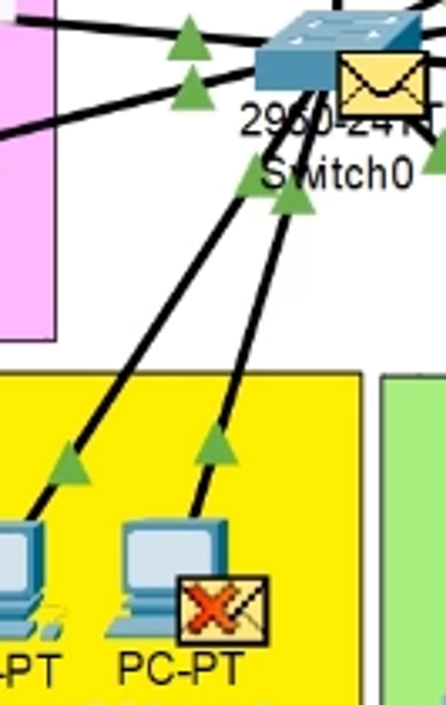

# AULA 04/03 - Ainda trabalhando com VLAN

[Aula 04 2023 VLAN.pkt](https://prod-files-secure.s3.us-west-2.amazonaws.com/7fcb26bc-7e98-4600-9532-f1d6c7affda3/ac62a9c3-9f18-4bbe-add4-7a34a400eb12/Aula_04_2023_VLAN.pkt)

Trablharemos com o seguinte modelo 


No início da aula foi debatido a questão de segurança da rede, onde podemos ter uma seguraça maior das redes realizando uma virtualização dela. Permitindo áreas isoladas e a comunicação delas tendo que ocorrer através do roteador (o qual tem firewall)

Agora iremos realizar uma configuração prática.

No modelo acima todos os equipamentos estão em única rede, ocasionando em um grande nº de broadcast

E nisso iremos criar 5 vlan’s dentro de uma rede física, para aumentar a segurança da rede e permitindo a comunicação entre elas apenas através da roteador o qual tem um firewall


No switch podemos visualizar que ele possui apenas uma vlan (a que vem de padrão)


Notamos que no lab2 (área rosa) os equipamentos estão conectados na interface Fa0/1 e Fa0/2 com isso iremos configurar no switch essas portas para a vlan 2

Ademais iremos condicionar ainda mais portas (indo até Fa0/7) para essa área pois no lab3 (área amarela) suas portas só começam a partir da Fa0/8


### Agora no switch entramos no modo de configuração
```
- Enable
- Configure terminal
```
### E criamos a vlan 2
```
- vlan 2
- name lab2 (dando nome a vlan)
```
### Movendo as devidas interfaces para a vlan 2
```
- interface fa0/1
- switchport access vlan 2
- interface fa0/2
- switchport access vlan 2
```
Agora falta configurar as interfaces restantes para essa vlan, nisso poderiamos configurar uma por uma MAS temos uma forma melhor de fazer isso

### MOVENDO MAIS DE UMA INTERFACE PARA UMA VLAN
```
- interface range fa0/3-fa0/7
- switchport access vlan 2
```
---

Agora na vlan 3 podemos configurar da interface fa0/8 até a Fa0/16

### Criando a vlan 3
```
- vlan 3
- name lab3
```
### Definindo as interfaces
```
- interface range fa0/8-fa0/16
- switchport access vlan 3
```
---

Agora repetimos o mesmo processo para criação das outras vlan’s

### Vlan 4
```
- vlan 4
- name wireless
```
### Definindo interfaces
```
- interface range fa0/24
- switchport access vlan 4
```
---

Agora, para a área administrativo podemos definir da interface fa0/17 até a fa0/23

### Vlan 5
```
- vlan 5
- name administrativo
```
### Definindo interfaces
```
- interface range fa0/17-fa0/23
- switchport access vlan 5
```
---

Agora, note que nossa interface gig0/2 (a qual tem conexão com o roteador) está conectada somente a vlan 1, impedindo que as outras vlan’s tenha comunicação com o roteador




Por isso precisamos realizar uma configuração com essa interface para que as outras vlan’s sejam capazes de ter acesso a internet

### INTERFACE TRONCO (TRUNK)

É uma interface que é compartilhada por todas as vlan’s 

Para realizar essa configuração realizamos 
```
- interface gig0/2
- switchport mode trunk
```
Nisso definimos que essa interface é uma interface tronco

Agora precisamos definir em quais vlan’s ela atuará com o comando
```
- switchport trunk allowed vlan all
```
Agora todas as vlan podem enviar dados para o roteador

Caso queiramos sair do modo trunk
```
- interface gig0/2
- no switchport mode trunk
- switchport mode access
- switchport access vlan 1
```
---

### Criando redes para as vlans

Agora precisamos criar um endereço de rede para cada vlan


E no roteador precisamos configurar os gateways para cada vlan


Nisso limpamos as configurações que estão na interface do roteador


Agora no roteador

```
- enable
- configure terminal
- interface GigabiEthernet0/0
- interface gig0/0.1 → aqui definimos uma subinterface
- encapsulation dot1q 1 → definimos que ela pertence a vlan 1
- ip address 192.168.1.1 255.255.255.0 → endereço ip e máscara da vlan 1
```

E por agora repetimos o processo
```
- interface gig0/0.2
- encapsulation dot1q 2
- ip address 192.168.2.1 255.255.255.0
```
Após realizar as configrações para todas as vlans podemos definir seus respectivos DHCP’s

Nisso iremos configurar 5 DHCP, um para cada rede

### Configurando DHCP
```
- ip dhcp pool VLAN1
- NETWORK 192.168.1.0 255.255.255.0 - rede que irá atender
- default-route 192.168.1.1 - ligando o DHCP ao gateway da rede
```
E então é só seguir os mesmos passos para as outras redes/vlans