# CRIAÇÃO Projeto MVC-RH 

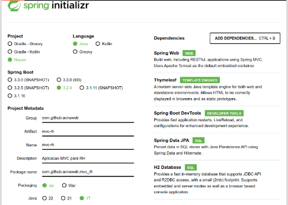

Esse projeto permitirá listar cargos aos funcionários, vincular endereços ao funcionários e vincular cargos aos departamentos 

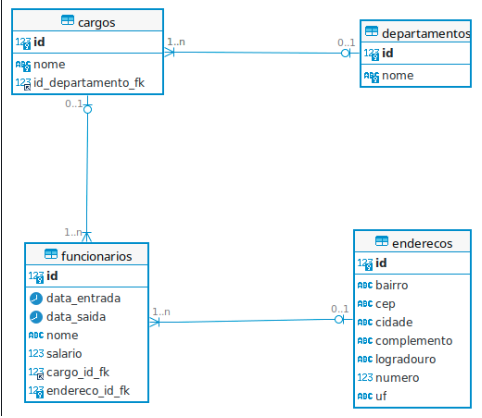

## CRIANDO AS TABELAS 

- ANTES: Rodamos uma vez a aplicação depois paramos ele e configuramos  
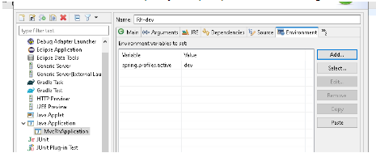
 

## CRIANDO TABELA DEPART 

Criamos uma package 

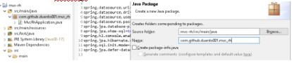

Criamos a classe 

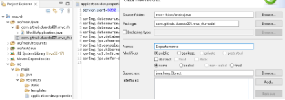

Adicionamos os atributos 

Lembre se de marcar com @Entity a classe para poder ser identificada como tabela e o @Id para alguma coisa que eu não sei  

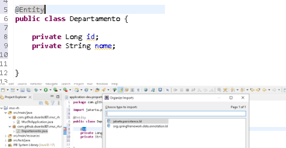

Para acessar essa tela no navegador rodamos a aplicação e escrevemos "localhost:8080/h2-console" 

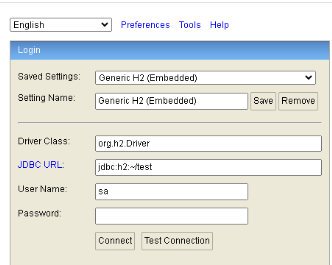

Para o cadastro usamos a url e a password 

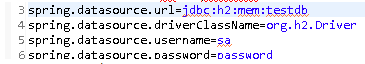

Logo temos a tela 

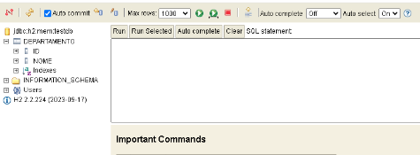

## MUDANDO O NOME DA TABELA 

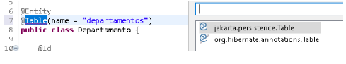

 

E APLICANDO OBRIGATORIEDADE EM NOME COM UM VARCHAR(60) E NOT NULL 

 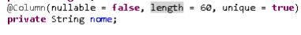

Aplicando para que os id sejam  gerados de forma automática e sequencial 

 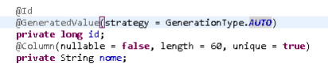

Sendo criado uma "Sequence" no h2-console 

 

Aplicamos a extensão/import 

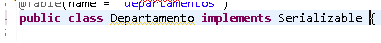

Isso para que oi Java possa criar um nº de serie para cada nova entidade criada e que ele possa armazenar seu valor 

 

## CRIANDO TABELA CARGOS 

Simplesmente damos um ctrl c + ctrl v no package model da classe depart 

E com isso aplicamos algumas alterações  

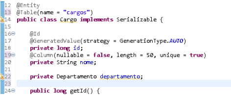

 

Aqui estamos aplicando a FK da tabela e dizemos como o java deve tratar a relação entre as colunas (uma para muitas) 

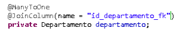
 

## CRIANDO A TABELA ENDERECO 

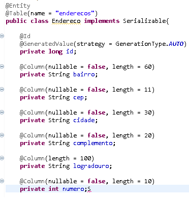
 

 

Criando uma classe que será a base das outras classes para tudo que há em comum entre elas  

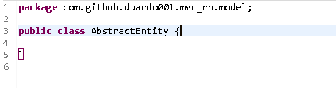

Aplicamos o atributo que há em comum 

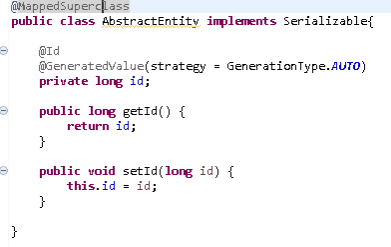

E após isso aplicamos a herança dessa classe nas outras  

 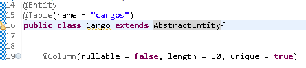

GERADOR DE ID Não SEQUENCIAIS: https://www.uuidgenerator.net/ 

Mas um problema que isso geraria seria o fato as tabelas serem criadas com ID fora do padrão que queremos ent para resolver isso aplicamos generic sobre a classe Abstract 

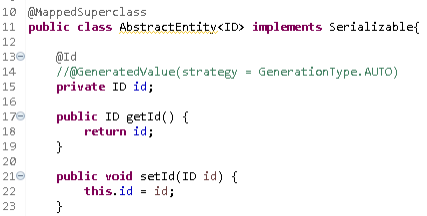

E ent com isso podemos definir como o Id irá se comportar em cada classe herdada, basta fazer 

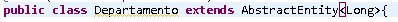

AINDA NECESSARIO CONFIGURAR PERFIL PRD<<<<<<<<<<<<<<<<< 