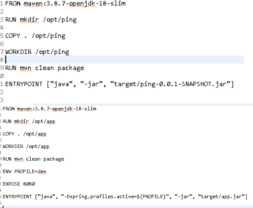
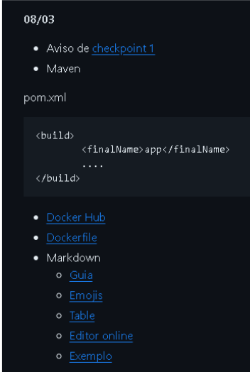
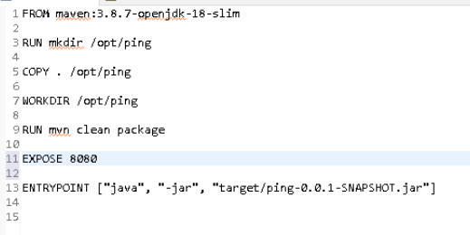
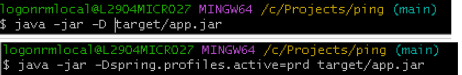
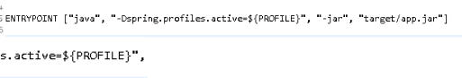
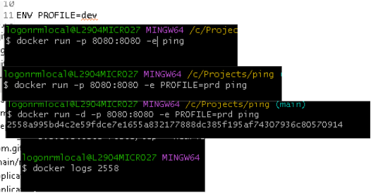

```
COISAS PRA SMP FAZER AO CHEGAR NA AULA 

CRIAR PASTA PROJETO NO C; ou D; 

CLONAR PROJETO DA aula 

ARRUMAR A VERSÃO DO JAVA EM "VARIABLES..." PARA VERSAO 18 
```
 

https://livesql.oracle.com/apex/f?p=590:1000 ----- site para BD  

 

# AULA PARA AJUDAR A COLOCAR JAVA NO PROJETO(???)- AULA 23/02 -SPRING – INIATIALZR E TALS 

 

TÓPICO 4 DO CHECKPOINT  

 
```
FROM maven:3.8.7- 
/ opt/ ping 
COPY . / opt/ ping 
WORKDIR / opt/ ping 
RON mun clean package 
ENTRYPOINT ["jaua", " j 
"target/ ping-e. e. I-SNAPSHOT. jar"] 
```
 

COM ALTERAÇÃO DA ULTIMA LINHA E TALS 

------------------- 

Criando uma documentação para um projeto 

Pegar o "exemplo"  



Fazer o download e colar no nosso projeto e teremos um arquivo de texto editavel  

Basta alterar o nome para README.md 

------------- 
```
Container = imagem em execução/aplicação ativa 
```
Para uma aplicação podemos fechar a janela ou dar ctrl c 

 

Quando rodamos uma imagem no container/docker ele usa uma porta interna dele pois possuem seu próprio Sistema Operacional deixando a porta do usuário livre para uso  

 

Podemos altera isso para acessar da porta da nossa máquina na seguinte forma  

Expor o container usando o dockerFile com o comando 

EXPOSE 8080 


E mapeá-la para portal local do usuário usando o comando  

```
docker run -p 8080:8080 ping 
```
 

Onde o primeiro 8080 é a porta do Windows e o segundo a do container o quais demos o EXPOSE 

 
```
no checkpoint no pom.xml n esquecer de colocar a classe "final name" 
```
---------------------- 

Quando precisamos rodar uma linha de comando específica (um profile) do nosso projeto  de dentro do Bash usamos o –D+"mais seu caminho sem tirar o espaço dela" 

 

-------------  

PARA COMPILAR/CRIAR UMA IMAGEM 
```
DOCKER BUILD –T PING . 
```
COMANDO PARA DOCKERFILE SÃO SMP EM MAISUCULO 

--------------------- 


AQUI VAMOS APLICAR UMA VARIAVEL AMBIENTE PARA TER ACESSO A MAIS DE UM PROFILE EXISTENTE DENTRO DO NOSSO ARQUIVO JAVA 


```
DOCKER BUILD –T DUARDO001/PING .edu - criando imagem com nome do usuario 

DOCKER PUSH  DUARDO001/PING - realizando um push coma imagem gerada 
```