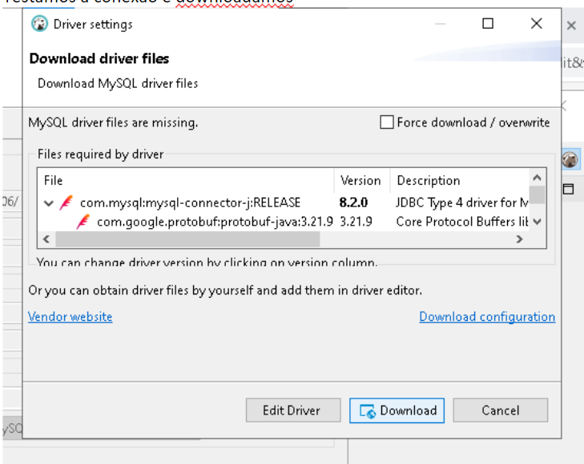

# Continuação Projeto MVC 

Inicie o docker 
Abra o docker  
Abra o git BASH a partir da pasta project  
Rode  

------------------------------- 
```
   docker run -d \ 

    -e MYSQL_ROOT_PASSWORD=root_pwd \ 

    -e MYSQL_USER=new_user \ 

    -e MYSQL_PASSWORD=my_pwd \ 

    -p 3306:3306 \ 

    Mysql 
```
---------------------------------- 

### Crie o perfil PRD e configure  


Estamos fazendo isso para permitir que aplicação aceite também o MySQL como banco de dados

-------------------------------------- 

### Sobre a classe endereço 

 

Aqui do jeito que está o usuário pode digitar qualquer palavra de 2 letrar e vamos alterar isso para que já tenhamos uma base de UF, aplicando um ENUM na classe (Corrija os getters e setters desse atributo)


 
Feito isso e acessando novamento o banco de dados notamos que o UF está como tinyint pois por padrão ele é definido como ORDINAL 

Para corrigir isso importamos 

Agora ele está aceitando VARCHAR

----
## Usando o MySQL 
Iremos baixar um BD para realizar testes 

Acessamos https://dbeaver.io/ 

Vamos em Download 


Pegamos  o zip 


Descompactamos  

Entramos na pasta  

E rodamos o EXE 


Após  abrir clique em sim  

Clique nessa setinha 

 

Faça o download 


Conectando ao banco de dados 


Selecionamos o MySQL 


Fazemos essa config 


OBS: A senha está lá no perfil PRD (root_pwd) 

 

Testamos a conexão e realizamos o download   


Caso de esse erro 


E mudamos essa config para true (Talvez tenha que clicar em detalhes)


Após fazer um novo teste temos o seguinte problema 

Damos ok e eh isso 


Abrindo a conexão ainda n temos o bd de RH 


Para resolver isso, rodamos a aplicação prd no eclipse 
 

Caso de o erro  

 

Vá no site https://mvnrepository.com/artifact/com.mysql/mysql-connector-j/8.3.0 


E importe a dependência de mysql 


Após isso rodamos novamente o perfil 


E voltando o dbeaver e dando um f5 temos 

-------------------------------- 
## Sobre o check02 

### No prd  

spring.datasource.url=jdbc:mysql://localhost:3306/rh?createDatabaseIfNotExist=true 

Copiar e colar só mudar o "rh" pelo nome do projeto  

### Sobre o Created_at da tabela pra ser criada 

Em vez de usar LocalDate usar LocalDateTime  

--------------------------------- 