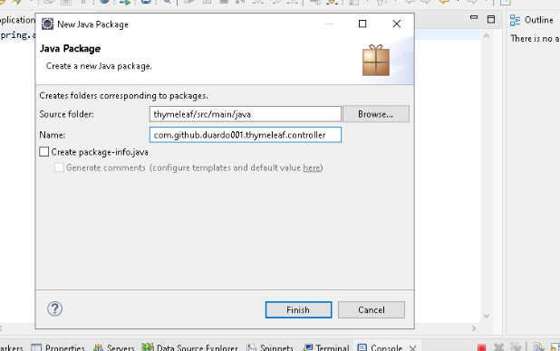
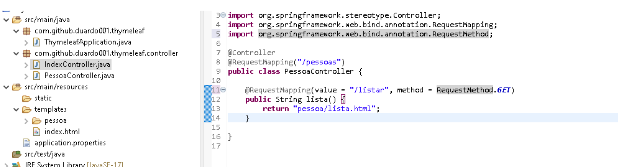

# Criaremos uma aplicação visual para nossa aplicação Java web 

Frameworks css: 
```
Materialize 
Material design 
W3.css 
```
 

Na nossa pasta Projects crie uma pasta com nome site (em minúsculo msm) 


Abra a pasta com o vsCode e crie um arquivo html (atalho pra criar o texto base "html:5") 


Crie um novo arquivo html agr com o nome lista 


Agora iremos criar uma tabela 


E no site da w3 na parte de bootstrap e pegamos um simples tabela 


Agora usamos o spring iniatialzr  


Jogamos dentro da nossa pasta Project 


Importamos para dentro do Eclipse 


Copiamos e jogamos os nossos 2 html nesse caminho ou tbm podemos jogar direto no eclipse arrastando os arquivos 


Agora iremos configurar o nosso projeto para que quando digitarmos
localhost:8080 ele retorne o nosso index.html 

1º Criamos um novo package de controller 


2º uma nova classe 

 

Na classe aplicamos um @ para que ela seja inteligente para responder ao navegador 

 

Aplicamos um método para retorno do arquivo 

Agora criamos uma nova pasta em "templates" como nome pessoa e arrastamos no lista.html para dentro dessa nova pasta 


Criamos uma nova classe no package controller e colocamos nome de PessoaController e configuramos ela para poder responder ao browser quando for chamado 

--------------------------------------- 
```
package com.github.duardo001.thymeleaf.controller; 

import org.springframework.stereotype.Controller; 

import org.springframework.web.bind.annotation.RequestMapping; 

import org.springframework.web.bind.annotation.RequestMethod; 


@Controller 

@RequestMapping("/pessoas") 

public class PessoaController { 

@RequestMapping(value = "/listar", method = RequestMethod.GET) 

public String lista() { 

return "pessoa/lista.html"; 

} 
} 

```

------------------------------------------------------------- 

 

Agora iremos realizar uma configuração para que os dados da lista venham de um BD, usemos um site chamado "mockaroo" 

Realizaremos um DTO 

Criamos um novo package 


E adicionamos uma nova classe 


Geramos getters e setters uma vez que estão privados 


Criamos um novo package 


Criamos uma classe dentro dele 


Nessa classe queremos por uma lista de pessoas e que ela seja retornada 


Existem 3 formas de fazer isso, a primeira eh essencial e a segunda e terceira são formas diferentes de adicionar um objeto depois de instanciar um construtor 


Agora iremos atualizar nosso PessoaController para que ele consiga ter acesso à nossa classe com lista onde o List atuara como controller e o return como view 


E usaremos agora do thymeleaf para melhor configuração, pois com ele conseguimos receber a lista e aplicar um "for"  

Na pratica iremos alterar nos list e colocar um for each que receberá pessoa em que para cada obejeto de pessoa colocará um tr, adicionando na tabela 

Na classe lista.html realizamos a seguinte modificação 


Aqui ele rodará em loop o que está na controller e realizará os dados que foram definidos para inclusão de pessoa, ficando assim 


 

Por agora iremos realizar uma configuração para não precisar ficar toda hora reiniciando a aplicação para atualizar ela  

Usando o spring initialzr pegamos a dependência Spring devtools 
```
<dependency> 

     <groupId>org.springframework.boot</groupId> 

     <artifactId>spring-boot-devtools</artifactId> 

     <scope>runtime</scope> 

     <optional>true</optional> 

</dependency> 
```
E colar ela dentro do pom.xml 


Agora colocaremos um novo método dentro de PessoaController, o model 

E importaremos a segunda pessoa 
