# Na aula de hoje aprimoraremos o cod da aula anterior 

E também entenderemos melhor a definição de MVC 

 

## MVC: 

Model: define o modelo ou domínio a aplicação 

Regras de negócios 

Persistência de dados 

View: Interação com o usuário 

Controller: Componente intermediário entre view e model 

Recebe requisições 

Envia respostas 

Interage com a camada model 

 

Para aula como auxílio usaremos: https://www.tutorialspoint.com/design_pattern/index.htm 

 

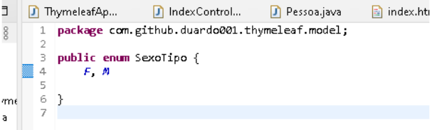
Criamos uma classe enum para permitir somente sexo do tipo "M" ou "F" 

Realizamos as alterações necessárias nas classes 

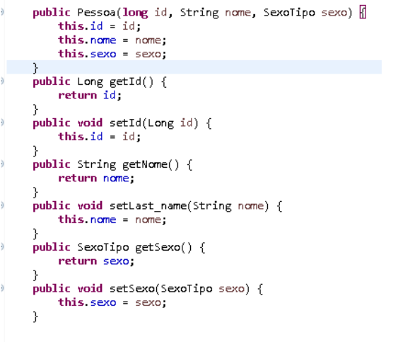
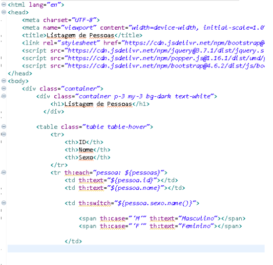
 

Entendendo InversãoDeController: 

 

Vamos entender e aplicar a questão do  

Ser capaz de sempre instanciar  

Aplicamos o @service na classe 
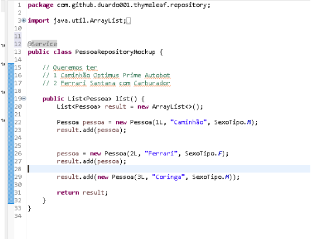
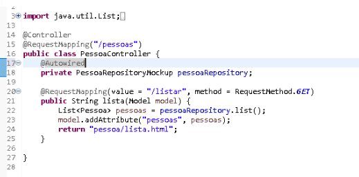

---
Logo após isso pegamos as dependências de "Data JPA" e  "H2database" 

No caso do h2 podemos pegar através do Spring Initialzr ou do https://mvnrepository.com/artifact/com.h2database/h2/2.2.224 

 

No pom  
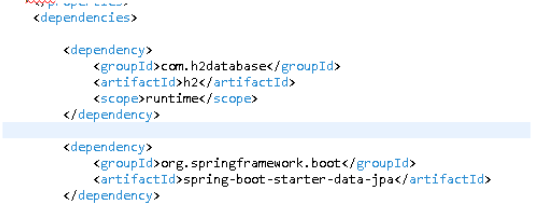

E caso queiramos uma dependência de Oracle 
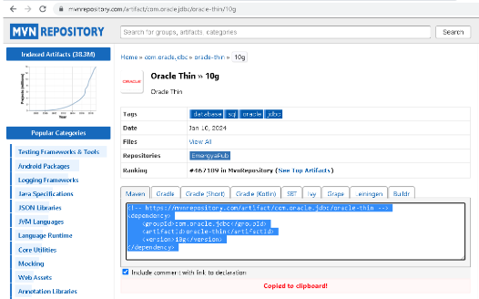

Digitando "/h2-console" temos a tela 
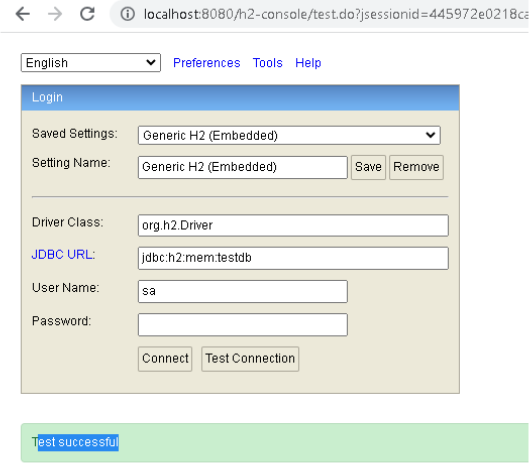

Colocamos como user name "jdbc:h2:mem:testdb" 

E senha "password" 

Com isso temos a tela 
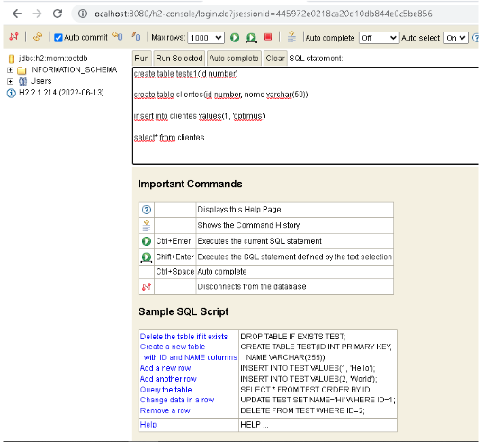

Nela podemos criar nossos dados de forma virtual 

 

Na classe Pessoa a menção entity e id (Selecionando a 1º opção qnd importar) 
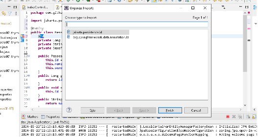

Com isso somos o java cria a tabela para nós já com os devidos atributos 
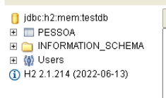

Criamos uma interface Repository 
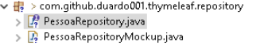
Aplicamos o @  

Para que ele seja capaz de trabalhar com BD

Agora temos que referenciar a entidade e classe que ele deve trabalhar 
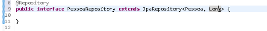

Corrigimos a classe PessoaController 
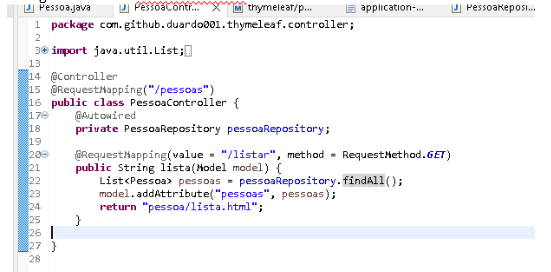
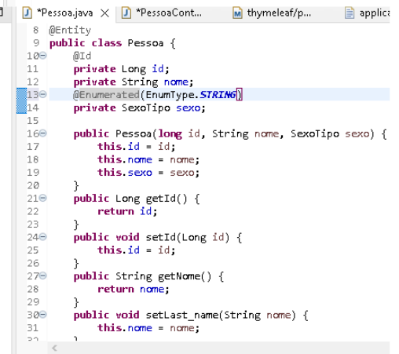
Correção com classe Pessoa acima 