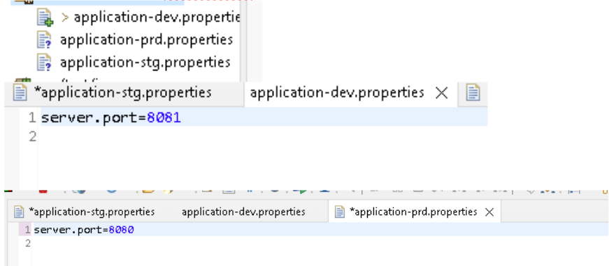

## Como clonar um projeto do GitHub e a partir dele criar seu repositório 

Definir um local para armazenar ele, seja no disc C ou D 


Clicar com o direito e abrir o Git Bash Here 


 

Comandos para entendimento 
```
Git init = inicializa o git 

ls = identificar quais arquivos tem na pasta 

pwd = mostrar aonde você está acessando  

ls-lah = mostrar o armazenamento/conteúdo daquela pasta 

Git = mostrar tds os comandos que podem ser usados 

Git clone = mostrar as formas de clonar um projeto 

Clear = limpa o terminal ou ctrl + L 

Cd "nome da pasta" = ele te coloca no diretório da pasta 

Git add . =  preparar arquivos para commit
```

 Acessando o arquivo que queremos clonar, copiamos a URL do projeto  


Após isso abrimos o terminal e digitamos "git clone" colando a URL 

 

Temos outras formas de fazer isso 

Consideramos que já tivéssemos uma pasta com o mesmo nome do projeto que iriamos clonar 

Para evitar problemas basta colocar "git clone + URL do arquivo + ping-new" 

 
 


Agora iremos linkar alguma dessas pastas com nosso novo repositorio 

Para isso apagaremos o .git de uma das pastas(está oculto) e seguiremos esses comandos 
 
 
Aqui dá um aviso dizendo que precisamos nos identificar para linkar os arquivos 

 
 

Agora digitamos os comandos para dar um "upload" 
 
 

E agora abre uma tela para nós nos logarmos 

Nessa tela iremos usar de um TOKEN para facilitar o login 

O TOKEN será gerado direto pelo GitHub

 

## GERANDO TOKEN 


Por padrões da AULA sempre usaremos o nome "fiap-aula" com 1 dia de duração, mas se é um ambiente caseiro pode deixar um prazo maior 

Além disso, marcaremos por agora SOMENTE repo e workflow 


Agora voltamos para a tela que pedia login e colocamos o TOKEN gerado 

Agora iremos trabalhar com portas de servidos, usando o branch e workflow 

Na pasta ping abrimo-la com o VS Code 

 
E agora com o VS code aberto, abrimos um terminal por lá msm 


Agora abrindo a aplicação .java do projeto  


E agora iremos relembrar os comandos Maven para ajudar a compilar e tals 


São eles  
```
Package = cria os arquivos class do java e os compila 

Clean = limpa a pasta target a qual é criado durante o package e armazena os arquivos java 
```
 

E agora com o terminal aberto  


Para melhor uso de tempo escrevemos "mv" e apertamos TAB e então escrevemos clean 

Analisando um problema que pode ocorrer com frequência  

Após darmos um mvnw package acontece o seguinte erro  


Esse erro ocorre porque um arquivo .javac que temos está com uma versão que não é compatível com a que estamos compilando 

Para resolver isso precisamos analisar quais java temos  

Seguindo esse caminho do disc C 


Temos  

Nisso vemos que nós estamos trabalhado com a versão do java 17 mas na máquina só temos a versão 18, por isso temos que realizar um alteração sobre qual versão de java vamos trabalhar 

Vamos realizar uma alteração de uma variável ambiente (JAVA_HOME) 

Seguindo esses passos 


Clicamos em enviroment variables  


Procuramos a variável que precisamos  


E nisso iremos aplicar a versão do java correta procurando no diretório  


Agora é só dar ok 

Fechamos o vsCode que estávamos trabalhando e abrimos um novo 

Digitamos ".\mvnw package " em um novo terminal  

 

 

Agora iremos trabalhar com o ECLIPSE 

Abrindo o eclipse iremos com a pasta "Projects" que criamos no disc D 

 

OBS: Checkpoint dia 8 

 

Agora com o eclipse aberto iremos importar um projeto maven que já existe  

 

E então iremos procurar nosso projeto dentro do folder/diretório  


Fazendo o java -jar pelo eclipse 


Se por ventura esquecemos de parar a aplicação e rodarmos de novo dará um erro dizendo que a porta do host já está em uso 


Para resolver isso localizamos quais aplicações estão rodando 


Nisso entramos na aplicação que está em execução e então encerramos  

 

Dando uma funcionalidade para essa nossa aplicação ping onde mandamos um sinal ping e nos retorna um texto "pong" 

Na package .github  


Agora vamos criar uma classe  


Aqui configuraremos para que a classe possa responder ao nosso comando de ping, usando da anotação @RestController, permitindo que todos os métodos que estiverem dentro daquela classe seja "ouvida" pelo browser 

Com isso criamos 


E agora precisamos fazer com que a classe fique disponível para acesso de  


Tendo a tela  


Inicialmente vamos a essa tela 


Teste com nome 


Agora iremos trabalhar com portas diferentes 

Temos que aprender a alterá-la 

Abrimos  


Pronto trocamos nossa porta 

Agora iremos atribuir várias aplicações para várias portas 

Nisso criamos outras apliccations as nomeando 


Agora precisamos disponibilizar essas portas para um "Run As" 

Nisso vamos  

 

Agora configuremos um Run configuration – enviroment – add  


Agora iremos criar um javaapllication pra isso criaremos uma copia e realizamos o mesmo processo mudando o "value" para stg 

Commitando 


 